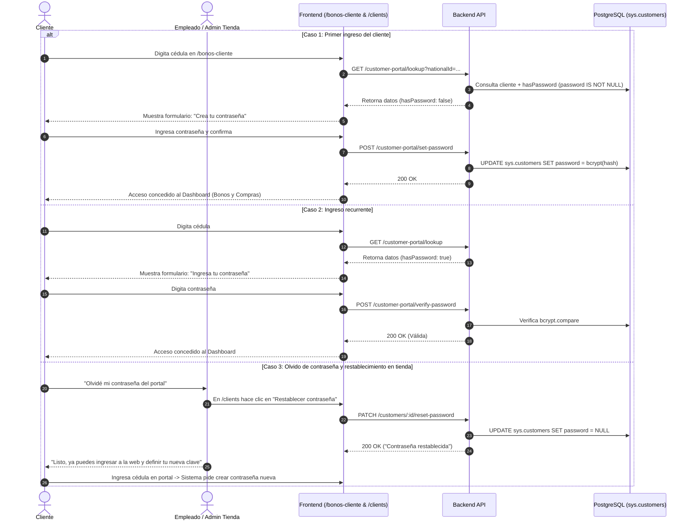
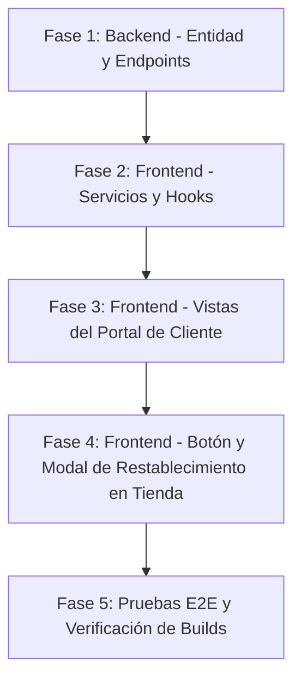

# Plan de Implementación: Requerimiento B1 (Autenticación y Gestión de Clave del Cliente)

Este documento contiene la especificación funcional, diseño técnico, casos de uso, criterios de aceptación, análisis de seguridad y plan de ejecución detallado para implementar el requerimiento **B1** del **Módulo de Ingreso Seguro** en los proyectos [proyecto-uni-pos-back](file:///Users/jaimem/Dev/code/tesis/proyecto-uni-pos-back) y [proyecto-uni-pos-front](file:///Users/jaimem/Dev/code/tesis/proyecto-uni-pos-front).

---

## 1. Definición y Alcance del Requerimiento

* **Requerimiento B1 (Tesis):**
  > *"El sistema debe permitir el inicio de sesión de administradores, empleados y clientes mediante credenciales válidas (usuario y contraseña)."*

* **Decisión de Alcance y Descarte de B2:**
  * **B2 (Rol "cliente" en RBAC interno):** Se descarta del desarrollo ya que el esquema RBAC (`sys.roles`, `sys.permissions`) está diseñado exclusivamente para el personal operativo (Administradores, Cajeros) que interactúa con la lógica interna del POS. Los clientes son usuarios externos consumidores de autoservicio y no deben mezclarse con la matriz de privilegios corporativos.
  * **Enfoque para B1:** Se incorpora un mecanismo de autenticación con credenciales (**Cédula + Contraseña cifrada**) diseñado para la experiencia retail:
    1. **Primer ingreso sin fricción:** La primera vez que el cliente ingresa su cédula en el portal para consultar sus bonos y compras, el sistema detecta que no tiene contraseña y le solicita crearla.
    2. **Ingresos subsecuentes:** En adelante, el cliente debe digitar su cédula y su contraseña para acceder.
    3. **Restablecimiento asistido en tienda:** Si el cliente olvida su clave, el personal de la tienda física puede restablecer su contraseña desde el módulo de administración de clientes (`/clients`). Al hacerlo, se borra la clave anterior para que, en su próximo ingreso web, el cliente defina una nueva contraseña.

---

## 2. Casos de Uso Detallados

### CU-01: Primer Ingreso y Definición de Contraseña por el Cliente

* **Actor:** Cliente.
* **Precondición:** El cliente está registrado en el sistema con su cédula en la tienda correspondiente (`sys.customers.password IS NULL`).
* **Flujo Principal:**
  1. El cliente ingresa a `/bonos-cliente` y digita su cédula.
  2. Si el cliente está en múltiples tiendas, selecciona la tienda correspondiente.
  3. El sistema identifica que el cliente no tiene contraseña configurada (`hasPassword === false`).
  4. La interfaz presenta la pantalla: *"Crea tu contraseña de acceso"*, solicitando Contraseña y Confirmar Contraseña (mínimo 6 caracteres).
  5. El cliente ingresa la contraseña y pulsa *"Guardar contraseña e ingresar"*.
  6. El backend genera el hash criptográfico `bcrypt` y actualiza `sys.customers.password`.
  7. El sistema da acceso inmediato al Dashboard del cliente (Bonos y Compras).

---

### CU-02: Inicio de Sesión de Cliente Recurrente

* **Actor:** Cliente.
* **Precondición:** El cliente ya cuenta con contraseña registrada (`sys.customers.password IS NOT NULL`).
* **Flujo Principal:**
  1. El cliente digita su cédula y selecciona su tienda.
  2. El sistema detecta que el cliente ya tiene contraseña (`hasPassword === true`).
  3. La interfaz presenta el campo: *"Ingresa tu contraseña"*, con un enlace visible: *"¿Olvidaste tu contraseña? Solicita su restablecimiento en la caja de la tienda"*.
  4. El cliente ingresa su contraseña y pulsa *"Iniciar Sesión"*.
  5. El backend valida el hash `bcrypt`. Si coincide, autoriza el acceso al Dashboard.
* **Flujo Alternativo (Contraseña incorrecta):**
  * El sistema muestra un mensaje de error claro: *"Contraseña incorrecta. Si no la recuerdas, acércate a la tienda física para restablecerla."*

---

### CU-03: Restablecimiento de Contraseña desde la Tienda (Personal Administrativo/Cajero)

* **Actor:** Cajero / Administrador de Tienda.
* **Precondición:** Usuario autenticado en el POS con permiso `customer:update`.
* **Flujo Principal:**
  1. El empleado ingresa al módulo de clientes (`/clients`).
  2. En la fila del cliente correspondiente, pulsa el botón de acción con ícono de llave: *"Restablecer contraseña del portal"*.
  3. Se abre un diálogo modal de confirmación explicando que la clave será eliminada y el cliente podrá registrar una nueva al volver a ingresar al portal.
  4. El empleado pulsa *"Confirmar restablecimiento"*.
  5. El backend actualiza `sys.customers.password = NULL` para ese registro.
  6. La tabla muestra una notificación Toast de éxito.

---

### CU-04: Re-registro de Contraseña tras Restablecimiento

* **Actor:** Cliente con contraseña recién restablecida.
* **Flujo:**
  1. El cliente vuelve a ingresar al portal `/bonos-cliente` con su cédula.
  2. Como `password` ahora es `NULL` (`hasPassword === false`), el portal le da la bienvenida y le solicita registrar una nueva contraseña (retornando al flujo de CU-01).

---

## 3. Diagrama de Flujo del Proceso



---

## 4. Criterios de Aceptación (Gherkin)

### Criterio 1: Creación de clave en primer acceso
```gherkin
Escenario: Cliente nuevo registra su clave por primera vez
  Dado que el cliente con cédula "10203040" no tiene contraseña registrada
  Cuando consulta su cédula en "/bonos-cliente" y selecciona su tienda
  Entonces el sistema muestra el formulario de creación de contraseña
  Cuando ingresa "MiClave123*" en ambos campos y pulsa "Guardar contraseña"
  Entonces la clave se almacena con hash bcrypt en la base de datos
  Y el cliente es redirigido inmediatamente a su dashboard de bonos y compras.
```

### Criterio 2: Acceso exitoso con clave existente
```gherkin
Escenario: Cliente recurrente ingresa con contraseña correcta
  Dado que el cliente con cédula "10203040" ya configuró su contraseña
  Cuando consulta su cédula en "/bonos-cliente"
  Entonces el sistema solicita su contraseña
  Cuando ingresa su contraseña correcta y pulsa "Ingresar"
  Entonces el sistema valida las credenciales y permite el acceso al dashboard.
```

### Criterio 3: Rechazo ante contraseña errónea
```gherkin
Escenario: Cliente ingresa contraseña equivocada
  Dado que el cliente ya tiene contraseña
  Cuando ingresa una contraseña errónea
  Entonces el sistema muestra el mensaje de error "Contraseña incorrecta"
  Y visualiza el enlace recordatorio para solicitar el restablecimiento en tienda.
```

### Criterio 4: Restablecimiento de contraseña por parte de la tienda
```gherkin
Escenario: Empleado de tienda restablece el acceso de un cliente
  Dado que el empleado está autenticado en el POS con permiso "customer:update"
  Cuando ingresa a "/clients" y hace clic en "Restablecer contraseña" del cliente "#15"
  Y confirma la acción en el diálogo modal
  Entonces el backend coloca el campo password en NULL
  Y la siguiente vez que el cliente consulte su cédula, el portal le solicitará crear una nueva clave.
```

---

## 5. Diseño Técnico de la Solución

### A. Base de Datos (`PostgreSQL` / `TypeORM`)
1. **Modificación en [customer.entity.ts](file:///Users/jaimem/Dev/code/tesis/proyecto-uni-pos-back/src/modules/customers/entities/customer.entity.ts):**
   ```typescript
   @Column({ type: 'varchar', length: 255, name: 'password', nullable: true, select: false })
   password?: string | null;
   ```
   * `nullable: true`: Permite clientes sin contraseña inicial y clientes post-restablecimiento.
   * `select: false`: Previene que el hash viaje accidentalmente en consultas SQL generales.

---

### B. Backend (`proyecto-uni-pos-back`)

#### 1. Módulo `customer-portal` (Endpoints Públicos para Clientes):
* **Actualización de `lookupCustomer`:**
  * En el `SELECT`, evaluar:
    ```sql
    (c.password IS NOT NULL) AS has_password
    ```
  * Mapear en `CustomerLookupResult`: `hasPassword: boolean`.
* **DTO `SetCustomerPasswordDto`:**
  * `customerId: number`, `companyId: number`, `storeId: number`, `password: string` (mínimo 6 caracteres).
* **DTO `VerifyCustomerPasswordDto`:**
  * `customerId: number`, `companyId: number`, `storeId: number`, `password: string`.
* **Nuevos endpoints en [customer-portal.controller.ts](file:///Users/jaimem/Dev/code/tesis/proyecto-uni-pos-back/src/modules/customer-portal/customer-portal.controller.ts):**
  * `POST /customer-portal/set-password`: Hashea con `bcrypt.hashSync(password, 10)` y guarda en base de datos.
  * `POST /customer-portal/verify-password`: Valida con `bcrypt.compareSync(password, customer.password)`.

#### 2. Módulo `customers` (Endpoints Administrativos en Tienda):
* **Nuevo endpoint en [customers.controller.ts](file:///Users/jaimem/Dev/code/tesis/proyecto-uni-pos-back/src/modules/customers/customers.controller.ts):**
  * `PATCH /customers/reset-password/:id`
  * Protegido con `@UseGuards(JwtAuthGuard, PermissionGuard)` y `@RequirePermissions(['customer:update'])`.
* **Método en [customers.service.ts](file:///Users/jaimem/Dev/code/tesis/proyecto-uni-pos-back/src/modules/customers/customers.service.ts):**
  ```typescript
  async resetPassword(customerId: number) {
      const customer = await this.customersRepository.findOne({ where: { id: customerId } });
      if (!customer) throw new NotFoundException('Cliente no encontrado');
      customer.password = null;
      await this.customersRepository.save(customer);
      return { ok: true, message: 'Contraseña restablecida correctamente.' };
  }
  ```

---

### C. Frontend (`proyecto-uni-pos-front`)

#### 1. Portal del Cliente (`/bonos-cliente`):
* **Actualización en [customerPortal.ts](file:///Users/jaimem/Dev/code/tesis/proyecto-uni-pos-front/src/services/customerPortal.ts):**
  * Agregar `hasPassword: boolean` a `CustomerLookupResult`.
  * Métodos `setPassword(data)` y `verifyPassword(data)`.
* **Actualización en [useCustomerPortal.ts](file:///Users/jaimem/Dev/code/tesis/proyecto-uni-pos-front/src/hooks/useCustomerPortal.ts):**
  * Estado `isPasswordVerified: boolean`.
  * Métodos para verificar y establecer contraseña.
* **Actualización en [CustomerPortalPage.tsx](file:///Users/jaimem/Dev/code/tesis/proyecto-uni-pos-front/src/pages/customer-portal/CustomerPortalPage.tsx):**
  * Nuevo paso intermedio **`auth`** (después de seleccionar tienda y antes de mostrar el dashboard):
    * **Caso `hasPassword === false`:** Tarjeta interactiva con campos para definir y confirmar clave, con botón para revelar/ocultar contraseña e indicador de requisitos.
    * **Caso `hasPassword === true`:** Tarjeta de login con campo de contraseña, botón de ingreso y texto de ayuda para recuperación presencial en tienda.

#### 2. Módulo de Administración de Clientes (`/clients`):
* **Actualización en [customer.ts](file:///Users/jaimem/Dev/code/tesis/proyecto-uni-pos-front/src/services/customer.ts):**
  * Método `resetPassword(customerId: number)`.
* **Nuevo componente [ResetCustomerPasswordDialog.tsx](file:///Users/jaimem/Dev/code/tesis/proyecto-uni-pos-front/src/components/customers/ResetCustomerPasswordDialog.tsx):**
  * Diálogo modal de confirmación con diseño seguro y alertas en color ámbar.
* **Actualización en [CustomersTable.tsx](file:///Users/jaimem/Dev/code/tesis/proyecto-uni-pos-front/src/components/customers/CustomersTable.tsx):**
  * Botón de acción con ícono de llave (`KeyRound` o `RotateCcw`) para restablecer la contraseña.
* **Integración en [CustomersPage.tsx](file:///Users/jaimem/Dev/code/tesis/proyecto-uni-pos-front/src/pages/store/customers/CustomersPage.tsx):**
  * Manejo del estado del diálogo y llamada al servicio con toast de confirmación.

---

## 6. Seguridad y Consideraciones Técnicas

| Aspecto | Estrategia de Mitigación |
| :--- | :--- |
| **Cifrado de Contraseñas** | Uso de `bcrypt` con 10 rondas de salt (estándar de la industria). |
| **Fuga de Credenciales** | La columna `password` tiene `select: false` en TypeORM para no enviarse en consultas generales. |
| **Aislamiento Multi-tienda** | La verificación y establecimiento de clave valida estrictamente la terna `customerId`, `companyId` y `storeId`. |
| **Control de Privilegios** | El restablecimiento en tienda exige autenticación JWT y permiso específico `customer:update`. |
| **Longitud Mínima** | Se exige una contraseña de al menos 6 caracteres para evitar claves triviales. |

---

## 7. Plan de Ejecución Paso a Paso



### Fase 1: Backend (`proyecto-uni-pos-back`)
1. Agregar campo `password` en `customer.entity.ts`.
2. Crear DTOs `SetCustomerPasswordDto` y `VerifyCustomerPasswordDto`.
3. Actualizar `lookupCustomer` en `customer-portal.service.ts` para retornar `hasPassword`.
4. Implementar `setPassword` y `verifyPassword` en `customer-portal.service.ts` y sus endpoints en el controlador.
5. Implementar `resetPassword` en `customers.service.ts` y endpoint en `customers.controller.ts`.
6. Probar build con `npm run build`.

### Fase 2: Servicios y Hooks Frontend (`proyecto-uni-pos-front`)
1. Actualizar `customerPortal.ts` con interfaces y métodos de contraseña.
2. Actualizar `customer.ts` con `resetPassword(customerId)`.
3. Actualizar `useCustomerPortal.ts` para gestionar el paso `auth` y la verificación.

### Fase 3: UI Portal del Cliente (`CustomerPortalPage.tsx`)
1. Crear el paso de autenticación (`AuthStep`) con las dos variantes (Crear contraseña y Validar contraseña).
2. Manejar mensajes de error, visibilidad de clave y enlace a recuperación en tienda.

### Fase 4: UI Administración de Clientes en Tienda
1. Crear componente `ResetCustomerPasswordDialog.tsx`.
2. Agregar botón de acción en `CustomersTable.tsx`.
3. Conectar evento en `CustomersPage.tsx` con feedback de Toast.

### Fase 5: Pruebas Integrales y Certificación
1. Validar registro de contraseña en cliente nuevo.
2. Validar inicio de sesión en cliente recurrente.
3. Validar rechazo con contraseña incorrecta.
4. Validar restablecimiento desde la tienda y re-registro en el siguiente ingreso.
5. Ejecutar `npm run build` en ambos proyectos (Backend y Frontend).
