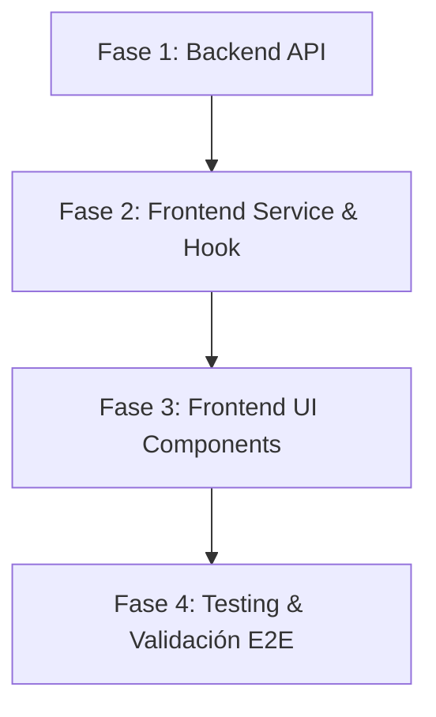

# Plan Detallado de Implementación: Requerimientos B4 y B5 (Portal del Cliente)

Este documento contiene la especificación completa, casos de uso, criterios de aceptación, diseño de arquitectura técnica, análisis de riesgos y plan de ejecución paso a paso para la implementación de los requerimientos **B4** y **B5** del **Módulo de Ingreso Seguro**.

---

## 1. Definición y Alcance de los Requerimientos

* **Requerimiento B4 (Historial de Compras):**
  > *"El sistema debe permitir al cliente consultar su historial de compras a través de la interfaz web."*
  * **Objetivo:** Permitir al cliente consultar la lista cronológica de todas las ventas registradas a su nombre en la tienda seleccionada.
* **Requerimiento B5 (Detalle de Compra con Productos):**
  > *"El sistema debe mostrar al cliente el detalle de cada compra realizada, incluyendo productos adquiridos, fecha y monto total."*
  * **Objetivo:** Al seleccionar una compra, desplegar un comprobante/detalle completo con el desglose de productos (nombre, cantidad, precio unitario, total de línea), fecha, método o canal, descuentos/bonos aplicados y total pagado.

---

## 2. Casos de Uso Detallados

### Caso de Uso CU-01: Consultar Historial de Compras del Cliente

* **Actor Principal:** Cliente (visitante del portal web).
* **Precondiciones:**
  1. El cliente ha ingresado su número de cédula en `/bonos-cliente`.
  2. El cliente ha seleccionado la tienda y empresa donde tiene registro.
* **Flujo Principal:**
  1. El cliente ingresa a la pestaña/sección **"Mis Compras"** en el panel principal.
  2. El sistema realiza una petición al backend solicitando las compras asociadas a su `customerId`, `companyId` y `storeId`.
  3. El sistema valida los parámetros y recupera las ventas ordenadas descendentemente por fecha (`created_at DESC`).
  4. La interfaz web muestra una lista o tarjetas resumen de compras, indicando para cada una:
     * Número/Código de venta (`#ID`).
     * Fecha y hora formateada (formato colombiano `es-CO`).
     * Cantidad total de artículos adquiridos.
     * Estado de la venta (`Completada`, `Pendiente`, etc.).
     * Total pagado en COP.
     * Botón de acción **"Ver detalle"**.
* **Flujos Alternativos:**
  * **FA-1 (Sin compras registradas):** Si el cliente no registra ventas en esa tienda, el sistema muestra un estado vacío (*empty state*) amigable: *"Aún no tienes compras registradas en esta tienda"*, con una ilustración o ícono y sugerencia de compra.
  * **FA-2 (Error de conexión / servidor):** El sistema muestra un mensaje de alerta Toast y un botón *"Reintentar"*.
* **Postcondiciones:** El cliente puede revisar cronológicamente sus compras y seleccionar cualquiera para ver su detalle.

---

### Caso de Uso CU-02: Visualizar Detalle de una Compra Específica

* **Actor Principal:** Cliente.
* **Precondiciones:** El cliente visualiza el listado de compras (CU-01).
* **Flujo Principal:**
  1. El cliente hace clic en el botón **"Ver detalle"** de una compra específica.
  2. El sistema abre un modal responsivo (*Dialog*) con estilo de factura/ticket digital.
  3. El modal muestra:
     * **Encabezado:** Número de compra, fecha y hora, datos de la tienda emisora (nombre y dirección).
     * **Tabla de productos:**
       * Nombre del producto.
       * Cantidad comprada.
       * Precio unitario ($).
       * Subtotal de la línea ($).
     * **Resumen financiero:**
       * Subtotal.
       * Descuento / Bonificaciones canjeadas (si aplicó bonos en esa venta).
       * Total final pagado.
  4. El cliente puede cerrar el modal haciendo clic en la "X", presionando la tecla `Escape` o haciendo clic fuera del diálogo.
* **Flujos Alternativos:**
  * **FA-1 (Producto descatalogado o eliminado):** Si un producto comprado fue dado de baja posteriormente en el inventario (`deleted_at IS NOT NULL`), el sistema sigue mostrando el nombre histórico y precio guardado en `sale_items`, evitando errores `404` o nulos.
* **Postcondiciones:** El cliente conoce con exactitud los productos adquiridos y el balance económico de su transacción.

---

## 3. Criterios de Aceptación (Gherkin & Checklist)

### Criterio 1: Carga y orden cronológico de compras
```gherkin
Escenario: Listar compras existentes del cliente
  Dado que el cliente consultó su cédula "12345678" y seleccionó la tienda "Sede Principal"
  Cuando ingresa a la pestaña "Mis Compras"
  Entonces el sistema muestra las ventas registradas para su customerId
  Y las compras se encuentran ordenadas de la más reciente a la más antigua
  Y cada fila muestra: Fecha, Código de Venta, Artículos totales y Valor total en COP.
```

### Criterio 2: Visualización del detalle de productos
```gherkin
Escenario: Apertura y visualización del detalle de una compra
  Dado que el cliente visualiza la compra "#45" por un total de "$50.000"
  Cuando hace clic en "Ver detalle"
  Entonces se abre el diálogo con el desglose de productos
  Y se lista cada producto con su nombre, cantidad, precio unitario y subtotal
  Y el total de la suma de ítems coincide con el subtotal y total reflejado en la cabecera.
```

### Criterio 3: Cliente sin compras
```gherkin
Escenario: Cliente nuevo sin transacciones comerciales
  Dado que el cliente está registrado pero aún no ha realizado compras en esa tienda
  Cuando accede a la pestaña "Mis Compras"
  Entonces no se muestran tablas vacías ni errores
  Y se muestra el mensaje "No registras compras en esta tienda aún".
```

### Criterio 4: Manejo de bonos y descuentos
```gherkin
Escenario: Compra donde se redimieron bonificaciones
  Dado que la compra "#12" utilizó $10.000 en bonos
  Cuando el cliente abre el detalle de la compra
  Entonces el resumen financiero muestra: Subtotal, Descuento/Bono canjeado (-$10.000) y Total final.
```

---

## 4. Diseño Técnico de la Solución

### A. Backend (`proyecto-uni-pos-back`)

#### 1. Nuevo Endpoint en `customer-portal.controller.ts`
Endpoint público dentro del módulo `customer-portal`:
* `GET /customer-portal/purchases`
* Parámetros Query: `customerId: number`, `companyId: number`, `storeId: number`

#### 2. Lógica en `customer-portal.service.ts`
Consulta SQL optimizada con TypeORM `DataSource` vinculando `sys.sales`, `sys.sale_items` y `sys.products`:

```sql
SELECT 
    s.id AS sale_id,
    s.total AS total,
    s.subtotal AS subtotal,
    s.discount_total AS discount_total,
    s.status AS status,
    s.channel AS channel,
    s.claim_bonus AS claim_bonus,
    s.created_at AS created_at,
    si.id AS item_id,
    si.quantity AS quantity,
    si.unit_price AS unit_price,
    si.line_total AS line_total,
    p.id AS product_id,
    p.name AS product_name,
    p.image AS product_image
FROM sys.sales s
LEFT JOIN sys.sale_items si ON si.sale_id = s.id
LEFT JOIN sys.products p ON p.id = si.product_id
WHERE s.customer_id = $1
  AND s.company_id = $2
  AND s.store_id = $3
  AND s.deleted_at IS NULL
ORDER BY s.created_at DESC, si.id ASC;
```

*Agrupación en memoria:* La función agrupa las filas por `sale_id`, generando una lista de compras donde cada una contiene su arreglo de `items: CustomerPurchaseItem[]`.

---

### B. Frontend (`proyecto-uni-pos-front`)

#### 1. Servicio `customerPortal.ts`
Añadir tipos y método `getPurchases(customerId, companyId, storeId)`.

#### 2. Hook `useCustomerPortal.ts`
* Estados: `purchases: CustomerPurchase[]`, `isLoadingPurchases: boolean`, `selectedPurchase: CustomerPurchase | null`.
* Método: `loadPurchases(customerId, companyId, storeId)`.
* Disparador automático al seleccionar tienda.

#### 3. Interfaz de Usuario en `CustomerPortalPage.tsx`
1. **Navegación por Pestañas:**
   * Pestaña 1: **"Bonos y Fidelización"** (Tarjeta de saldo + mini stats + movimientos).
   * Pestaña 2: **"Mis Compras"** (Lista de compras con estado, monto, fecha y botón de detalle).
2. **Componente `PurchaseDetailModal`:**
   * Diálogo modal responsivo con Shadcn (`Dialog`, `DialogContent`, `DialogHeader`, `DialogTitle`).
   * Visualización del ticket digital con lista de productos y desglose del pago.

---

## 5. Posibles Bugs, Casos de Borde y Mitigaciones

| Caso de Borde / Riesgo | Causa Potencial | Mitigación Técnica |
| :--- | :--- | :--- |
| **1. Producto eliminado del catálogo** | Un producto vendido en el pasado fue borrado de `sys.products`. | Usar `LEFT JOIN` y fallback: `p.name ?? 'Producto no disponible'` para que la venta no desaparezca. |
| **2. Mezcla de datos multi-tenant** | El cliente tiene el mismo documento en dos tiendas distintas de diferentes empresas. | El `WHERE` filtra obligatoriamente por la terna `(customer_id, company_id, store_id)`. |
| **3. Ventas con monto decimal / moneda** | Números flotantes que pueden generar diferencias de centavos. | Parsear con `Number(row.total)` y formatear con `Intl.NumberFormat('es-CO', { style: 'currency', currency: 'COP' })`. |
| **4. Redondeo en compras con bonos** | Ventas donde `claim_bonus = true` y el total es menor al subtotal. | Desglosar explícitamente: `Subtotal`, `Bono aplicado: -$X.XXX` y `Total pagado: $Y.YYY`. |
| **5. Sobreflujo en pantallas móviles** | Tablas de productos anchas en celulares. | Diseñar la lista de productos del detalle con tarjetas tipo lista (*stacked rows*) en pantallas pequeñas y tabla en pantallas grandes (`sm:table`). |

---

## 6. Plan de Trabajo Paso a Paso



### Fase 1: Backend (`proyecto-uni-pos-back`)
1. Crear método `getPurchases(customerId, companyId, storeId)` en `customer-portal.service.ts`.
2. Crear endpoint `GET /customer-portal/purchases` en `customer-portal.controller.ts`.
3. Validar con TypeScript y build (`npm run build`).

### Fase 2: Servicios y Estado Frontend (`proyecto-uni-pos-front`)
1. Actualizar `customerPortal.ts` con interfaces y método `getPurchases`.
2. Actualizar `useCustomerPortal.ts` para manejar estado y carga de compras.

### Fase 3: Interfaz de Usuario Frontend
1. Crear componente `PurchaseDetailModal.tsx`.
2. Incorporar el sistema de navegación por pestañas en `CustomerPortalPage.tsx`.
3. Renderizar listado de compras con estados de carga y acción de ver detalle.

### Fase 4: Pruebas y Validación
1. Probar con un cliente que tenga ventas registradas.
2. Probar con un cliente sin ventas.
3. Verificar responsividad y ejecutar `npm run build` en ambos proyectos.
