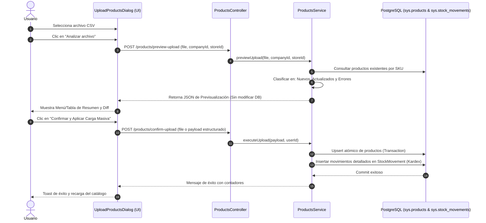

# Plan de Implementación: Carga Masiva CSV con Previsualización (Diff), Upsert por SKU y Trazabilidad en Kardex

**Proyecto:** Sistema POS Multi-tenant (Tesis)  
**Fecha:** 4 de Octubre de 2026  
**Documento:** `docs/plan-implementacion-carga-csv-productos.md`  
**Módulo:** Inventario / Productos (`proyecto-uni-pos-back` y `proyecto-uni-pos-front`)

---

## 1. Objetivos del Requerimiento

El usuario ha solicitado optimizar y robustecer el flujo de importación masiva de productos vía CSV bajo cuatro (4) reglas de negocio clave:

1. **Columna de Stock Mínimo Opcional (`stock_minimo`):** Permitir especificar el umbral de alerta en el archivo CSV; si se omite, aplicar el valor por defecto (`5`) para productos nuevos o conservar el actual para existentes.
2. **Upsert inteligente basado en SKU:** Si el archivo contiene un producto cuyo `sku` ya existe en la empresa y tienda, **no debe duplicarse**, sino **actualizarse** con la nueva información.
3. **Registro completo y detallado en el Kardex (`StockMovement`):** Cada producto creado o actualizado mediante CSV debe generar una traza detallada en el historial de movimientos de inventario:
   - Para productos nuevos: movimiento tipo `INITIAL` con el stock ingresado.
   - Para productos actualizados con cambio de stock: movimiento tipo `MANUAL_ENTRY` (si aumentó) o `ADJUSTMENT` (si varió), guardando en el motivo (`reason`) los cambios de precio, stock anterior, stock nuevo y variación.
4. **Menú de Previsualización Detallada antes de Confirmar (Dry-Run / Preview):** Antes de persistir en base de datos, el usuario debe ver un desglose visual interactivo con:
   - Cantidad de productos a crear (nuevos).
   - Cantidad de productos a actualizar (existentes) con comparativa de valores anteriores vs nuevos (precios, stock, etc.).
   - Filas con error o campos faltantes (si aplica).
   - Botón de confirmación final para aplicar los cambios o volver atrás.

---

## 2. Análisis del Estado Actual vs. Requerimientos

```
┌────────────────────────────────────────────────────────────────────────────────────────┐
│                        ESTADO ACTUAL vs. REQUERIDO CSV                                 │
├────────────────────────────────┬───────────────────────────────────────────────────────┤
│ Estado Actual                  │ Requerimiento Solicitado                              │
├────────────────────────────────┼───────────────────────────────────────────────────────┤
│ • Guarda ciegamente sin revisar│ • Upsert: Busca por SKU. Si existe actualiza, si no   │
│   si el SKU ya existe.         │   crea uno nuevo.                                     │
│ • No procesa stock mínimo.     │ • Columna 'stock_minimo' opcional en CSV.             │
│ • No registra movimientos en   │ • Traza automática en Kardex con motivo detallado     │
│   el Kardex (StockMovement).   │   (variación de unidades, cambio de precios, etc.).   │
│ • La carga se ejecuta directo  │ • Pantalla de previsualización interactiva con tabla   │
│   sin vista previa ni diff.    │   comparativa (Nuevo vs Actualizado) antes de guardar.│
└────────────────────────────────┴───────────────────────────────────────────────────────┘
```

---

## 3. Especificación del Formato CSV Actualizado

El archivo CSV mantendrá el delimitador detectado automáticamente (`;` o `,`) y soportará la nueva columna opcional `stock_minimo`:

| Columna | Obligatorio | Descripción | Ejemplo | Comportamiento |
|---|:---:|---|---|---|
| `name` | Sí | Nombre del producto | `Arroz Diana 1kg` | Se crea o actualiza |
| `sku` | No (Recomendado) | Código interno de inventario | `ARR-DIA-1K` | **Clave de coincidencia (Upsert)** |
| `precio_compra` | Sí | Costo de adquisición | `3200` | Se crea o actualiza |
| `precio_venta` | Sí | Precio al público | `4200` | Se crea o actualiza |
| `stock` | Sí | Cantidad física en inventario | `50` | Si es nuevo: inicial. Si existe: nuevo stock y se calcula variación |
| **`stock_minimo`** | **No** | **Umbral para alertas visuales** | **`10`** | **Nuevo campo opcional (Default: 5)** |
| `barcode` | No | Código de barras | `7701234567890` | Se crea o actualiza |
| `image` | No | URL de la imagen | `https://.../img.jpg`| Se crea o actualiza (si viene vacío se mantiene la actual) |
| `category` | No | Nombre de la categoría | `Granos` | Si no existe, se crea automáticamente |

---

## 4. Arquitectura y Diseño Técnico

### 4.1. Flujo de Previsualización y Confirmación



---

## 5. Cambios Detallados por Componente

### 5.1. Backend (`proyecto-uni-pos-back`)

#### A. Nuevo Endpoint de Previsualización (`POST /products/preview-upload`)
- **Controlador:** `@Post('preview-upload')` con `FileInterceptor('file')`.
- **Lógica de Servicio (`previewUpload`):**
  1. Parsea el CSV usando `detectCSVSeparator`.
  2. Valida encabezados y tipos de datos por fila.
  3. Extrae todos los `sku` no vacíos de las filas.
  4. Realiza una sola consulta a `ProductRepository`:
     ```typescript
     const existingProducts = await this.productRepository.find({
         where: { company: { id: companyId }, storeId, sku: In(skus) },
         relations: ['category']
     });
     ```
  5. Construye la respuesta estructurada:
     - `toCreate`: Lista de productos nuevos (no existen en BD).
     - `toUpdate`: Lista de productos existentes con diff:
       - `name`: actual vs nuevo.
       - `purchasePrice`: actual vs nuevo.
       - `salePrice`: actual vs nuevo.
       - `stock`: actual vs nuevo, y cálculo de `quantityDiff = nuevo - actual`.
       - `minStock`: actual vs nuevo.
       - `category`: actual vs nuevo.
     - `invalidRows`: Filas con errores de validación (campos requeridos vacíos, precios negativos).
     - `summary`: Resumen con contadores (`totalRows`, `newCount`, `updateCount`, `errorCount`, `netStockAdded`).

#### B. Endpoint de Ejecución con Upsert y Kardex (`POST /products/uploadProductsByFile`)
- **Lógica en Transacción (`processTransaction`):**
  1. Resolver categorías inexistentes en batch (manteniendo la optimización actual).
  2. Para productos que se **actualizan**:
     - Cargar entidad existente.
     - Guardar `previousStock`.
     - Actualizar precios, nombre, categoría, barcode, image y `minStock`.
     - Actualizar `stock = nuevoStock`.
     - Si `nuevoStock !== previousStock`:
       - Calcular `diff = nuevoStock - previousStock`.
       - Crear registro en `StockMovement`:
         - `type`: `diff > 0 ? 'MANUAL_ENTRY' : 'ADJUSTMENT'`.
         - `quantity`: `diff`.
         - `previousStock`: `previousStock`.
         - `newStock`: `nuevoStock`.
         - `reason`: `"Carga masiva CSV: Ajuste de existencias (${previousStock} -> ${nuevoStock}). Precio venta: $${newPrice}."`
     - Si el stock no cambió pero cambiaron los precios:
       - Registrar movimiento de auditoría opcional o traza con `quantity: 0`.
  3. Para productos **nuevos**:
     - Crear entidad `Product` con `minStock: row.stock_minimo || 5`.
     - Guardar producto.
     - Si `stock > 0`, crear registro en `StockMovement`:
       - `type`: `'INITIAL'`.
       - `quantity`: `stock`.
       - `previousStock`: `0`.
       - `newStock`: `stock`.
       - `reason`: `"Carga masiva CSV: Registro inicial de producto."`

---

### 5.2. Frontend (`proyecto-uni-pos-front`)

#### A. Rediseño del Diálogo `UploadProductsDialog.tsx`
El diálogo pasará a ser un **asistente por pasos (Wizard de 2 fases)**:

* **Fase 1: Carga y Selección de Archivo:**
  - Descarga de plantilla actualizada con la columna `stock_minimo`.
  - Zona de arrastrar y soltar archivo CSV.
  - Tabla de instrucciones clara con las reglas de SKU para actualización.
  - Botón: **"Analizar y Previsualizar Cambios"** (con spinner de carga).

* **Fase 2: Menú de Previsualización Detallada (Diff Visual):**
  - **Tarjetas de Resumen Superior:**
    - 🟢 **Nuevos:** `+X productos`
    - 🔵 **A Actualizar:** `~Y productos`
    - 🔴 **Con Errores:** `Z filas` (si hay errores, botón para ver cuáles son)
  - **Pestañas / Filtro de Lista:**
    - *Todos (`N`)* | *Nuevos (`X`)* | *Actualizaciones (`Y`)* | *Errores (`Z`)*
  - **Tabla de Cambios:**
    - Columna **Acción**: Insignia verde `[CREAR]` o azul `[ACTUALIZAR]`.
    - Columna **Producto**: Nombre y SKU.
    - Columna **Precio Venta**: Muestra cambio si aplica (ej: `$3.000 ➔ $3.500` o `$3.500`).
    - Columna **Stock**: Muestra variación con flecha y badge (ej: `10 ➔ 25 (+15)` o `+20`).
    - Columna **Stock Mínimo**: Muestra valor asignado (ej: `10 unids`).
    - Columna **Categoría**: Categoría asignada.
  - **Barra de Acciones Inferior:**
    - Botón **"Cambiar archivo"** (regresa a la fase 1).
    - Botón **"Cancelar"**.
    - Botón destacado: **"Confirmar y Aplicar Carga Masiva (X cambios)"**.

#### B. Servicios y Tipos
- Actualizar `ProductsService` en frontend con:
  - `previewUploadProducts(companyId, storeId, file)`
  - `uploadProducts(companyId, storeId, file)`
- Definir interfaces de TypeScript:
  - `CsvPreviewResponse`
  - `CsvProductToCreate`
  - `CsvProductToUpdate`
  - `CsvInvalidRow`

---

## 6. Plan de Ejecución por Tareas (Roadmap)

### Paso 1: Backend - Endpoint de Previsualización y Lógica de Upsert
1. Crear DTO o interfaz de respuesta para la previsualización (`CsvPreviewResponseDto`).
2. Implementar `previewUpload` en `ProductsService` que parsee, cruce por SKU con BD y retorne el diff sin guardar.
3. Actualizar `uploadProducts` en `ProductsService` para ejecutar el upsert (actualizar existentes por SKU y crear nuevos) en una transacción TypeORM.
4. Generar los registros correspondientes en `StockMovement` (Kardex) para cada fila procesada (nuevos y actualizados con detalles de precios y variación).
5. Agregar rutas en `ProductsController`: `POST /products/preview-upload`.
6. Compilar y verificar con `pnpm run build`.

### Paso 2: Frontend - Servicios y Adaptación de Tipos
1. Crear tipos de datos para previsualización en `src/types/Products.ts`.
2. Agregar método `previewUpload` a `ProductsService` en `src/services/products.ts`.
3. Exponer `previewUpload` en `useProducts.ts`.

### Paso 3: Frontend - Menú y Componente de Previsualización (Wizard)
1. Actualizar la plantilla CSV de ejemplo en `UploadProductsDialog.tsx` incluyendo `stock_minimo`.
2. Implementar vista de previsualización en `UploadProductsDialog.tsx` con tabs (Nuevos, Actualizaciones, Errores).
3. Renderizar las comparativas de cambio de stock y precios de forma intuitiva.
4. Conectar la confirmación definitiva que ejecute la carga y actualice el catálogo principal.
5. Compilar y verificar con `pnpm run build`.

---

## 7. Criterios de Aceptación y Pruebas

- [ ] **Prueba de Columna Opcional:** Un archivo CSV con columna `stock_minimo` asigna dicho valor; un archivo sin esa columna asigna `5` por defecto.
- [ ] **Prueba de Upsert por SKU:** Si se sube un CSV con el SKU `PROD-001` (ya existente en la base de datos), el producto actualiza sus precios y stock, sin crear una fila duplicada.
- [ ] **Prueba de Kardex en Carga Masiva:** Al revisar el historial del producto actualizado, se observa el movimiento generado por CSV indicando la cantidad anterior, la nueva y la variación.
- [ ] **Prueba de Previsualización (Fase 2):** Al subir el archivo, el usuario ve el desglose claro de qué filas son creaciones y cuáles son actualizaciones antes de que se guarde nada en la base de datos.
- [ ] **Prueba de Cancelación:** Si en la previsualización el usuario cancela, no se aplica ningún cambio en la base de datos.
