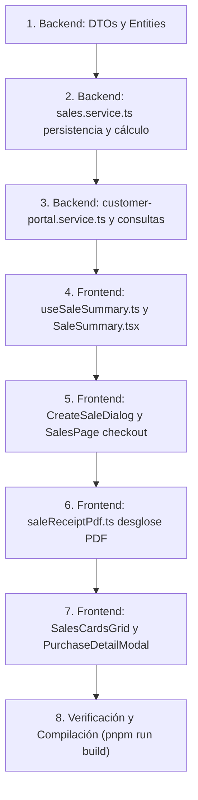

# Plan de Implementación: Requerimiento V3 - Cálculo y Desglose Automático de Impuestos (IVA)

> **Módulo:** Gestión de Ventas (POS)  
> **Requerimiento:** V3 - "El sistema debe calcular automáticamente el subtotal, los impuestos y el total de la venta."  
> **Fecha:** Octubre 2026  
> **Gestor de Paquetes Obligatorio:** `pnpm` (ambos proyectos)  
> **Regla de Ejecución:** No realizar commit hasta autorización explícita del usuario.

---

## 1. Resumen Ejecutivo y Diagnóstico

### 1.1 Estado Actual vs. Brecha Detectada
Actualmente, el sistema calcula de manera simplificada:
$$\text{Total} = \text{Subtotal} = \sum (\text{precio unitario} \times \text{cantidad})$$
Sin embargo:
1. **En la creación de la venta ([`SaleSummary.tsx`](file:///Users/jaimem/Dev/code/tesis/proyecto-uni-pos-front/src/components/sales/SaleSummary.tsx) y [`useSaleSummary.ts`](file:///Users/jaimem/Dev/code/tesis/proyecto-uni-pos-front/src/hooks/useSaleSummary.ts)):** No se toma en cuenta el atributo `product.taxExempt` (exento de impuestos). Todos los productos se suman planos sin liquidar el IVA correspondiente.
2. **En la persistencia Backend ([`sales.service.ts`](file:///Users/jaimem/Dev/code/tesis/proyecto-uni-pos-back/src/modules/sales/sales.service.ts)):** La base de datos ya cuenta con las columnas fiscales (`tax_total`, `subtotal` en `sys.sales`, y `vat_rate`, `vat_amount` en `sys.sale_items`), pero el backend actualmente las omite o guarda en cero (`vat_rate: undefined`, `vat_amount: 0`, `tax_total: 0`).
3. **En la consulta de ventas ([`getAllSales`](file:///Users/jaimem/Dev/code/tesis/proyecto-uni-pos-back/src/modules/sales/sales.service.ts#L39-L105) y [`getPurchases`](file:///Users/jaimem/Dev/code/tesis/proyecto-uni-pos-back/src/modules/customer-portal/customer-portal.service.ts#L204-L245)):** El `SELECT` no extrae `subtotal`, `tax_total` ni los valores de IVA por ítem.
4. **En el Comprobante Digital PDF ([`saleReceiptPdf.ts`](file:///Users/jaimem/Dev/code/tesis/proyecto-uni-pos-front/src/utils/saleReceiptPdf.ts)):** El cuadro de resumen financiero solo muestra "Subtotal", "Descuento" y "Total", sin desglosar la base gravable ni el monto liquidado de IVA.
5. **En las Vistas de Historial ([`SalesCardsGrid.tsx`](file:///Users/jaimem/Dev/code/tesis/proyecto-uni-pos-front/src/components/sales/SalesCardsGrid.tsx) y [`PurchaseDetailModal.tsx`](file:///Users/jaimem/Dev/code/tesis/proyecto-uni-pos-front/src/pages/customer-portal/PurchaseDetailModal.tsx)):** No se visualiza el valor de los impuestos cobrados.

---

## 2. Definición del Modelo Matemático y Tributario

En concordancia con el régimen tributario comercial estándar (Colombia - COP):
* **Tasa Estándar de IVA:** **19%** (`0.19`).
* **Condición de Gravamen:** 
  - Si `product.taxExempt === true` ➔ Producto Exento (IVA 0%).
  - Si `product.taxExempt === false` ➔ Producto Gravado (IVA 19%).

### 2.1 Fórmulas de Liquidación en Caja

Para cada producto $i$ de la venta:
1. **Base Gravable de la Línea ($\text{Subtotal}_i$):**
   $$\text{Subtotal}_i = \text{precio\_unitario}_i \times \text{cantidad}_i$$
2. **Tasa de IVA ($\text{Tasa}_i$):**
   $$\text{Tasa}_i = \begin{cases} 0\% & \text{si } \text{taxExempt} = \text{true} \\ 19\% & \text{si } \text{taxExempt} = \text{false} \end{cases}$$
3. **Monto de IVA de la Línea ($\text{IVA}_i$):**
   $$\text{IVA}_i = \text{round}\left(\text{Subtotal}_i \times \frac{\text{Tasa}_i}{100}, 2\right)$$
4. **Total de la Línea ($\text{TotalLínea}_i$):**
   $$\text{TotalLínea}_i = \text{Subtotal}_i + \text{IVA}_i$$

Para la Venta Global:
* **Subtotal Base ($\text{Subtotal}$):** $\sum \text{Subtotal}_i$
* **Base Gravable (19%):** Suma de subtotales de productos con IVA.
* **Base Exenta (0%):** Suma de subtotales de productos exentos.
* **Total Impuestos ($\text{tax\_total}$):** $\sum \text{IVA}_i$
* **Descuento / Bonificación:** $\text{bonusUsed}$
* **Total a Pagar:**
  $$\text{Total Final} = \text{Subtotal} + \text{tax\_total} - \text{Descuento}$$

### 2.2 Garantía de Inmutabilidad y Snapshot Histórico (Protección contra Cambios Futuros)

> [!IMPORTANT]
> **REGLA DE ORO DE AUDITORÍA CONTABLE: LAS VENTAS PASADAS SON INMUTABLES**  
> Si en el futuro un administrador edita el catálogo de productos:
> 1. Modifica el precio de venta (`salePrice`).
> 2. Cambia la condición fiscal de un producto de gravado a exento o viceversa (`taxExempt: true/false`).
> 3. Elimina o da de baja un producto del catálogo (`deleted_at`).
> 
> **Ninguna venta histórica, ni el historial de ventas, ni los comprobantes/facturas PDF generados deben verse afectados jamás.**

#### ¿Cómo se garantiza esta protección en la arquitectura?
1. **Fotografía Inmutable al Momento de la Venta (Snapshot en Base de Datos):**
   - En el instante de la transacción en caja, el backend congela y guarda de forma persistente los valores en `sys.sale_items` y `sys.sales`:
     - `sale_items.unit_price`: precio unitario con el que se vendió.
     - `sale_items.vat_rate`: tasa porcentual de IVA aplicada en ese momento exacto (19 o 0).
     - `sale_items.vat_amount`: valor monetario del IVA liquidado en ese instante.
     - `sale_items.line_total`: total liquidado para esa línea.
     - `sales.subtotal`, `sales.tax_total`, `sales.total`: consolidado financiero auditado.
2. **Consultas de Lectura Libres de Recálculo Dinámico:**
   - Tanto `SalesService.getAllSales` como `CustomerPortalService.getPurchases` leen única y exclusivamente de las columnas congeladas de `sys.sales` (`s`) y `sys.sale_items` (`si`).
   - El join con `products` se utiliza únicamente para traer el nombre o imagen referencial (`p.name`, `p.image`), pero **JAMÁS** para recalcular precios, impuestos o subtotales.
3. **Generación Fiel de Factura PDF:**
   - La factura en PDF (`saleReceiptPdf.ts`) se nutre estrictamente de los valores históricos registrados (`item.unitPrice`, `item.vatAmount`, `item.vatRate`, `sale.subtotal`, `sale.taxTotal`).
   - Por tanto, reimprimir o volver a previsualizar una factura de hace meses o años siempre reflejará con 100% de fidelidad las condiciones fiscales y comerciales vigentes en el segundo exacto en que se timbró la transacción.

---

## 3. Plan de Implementación Detallado



### Fase 1: Backend (`proyecto-uni-pos-back`)

#### 1.1 Actualización de DTOs (`src/modules/sales/dto/create-sale.dto.ts`)
* En `CreateSaleItemDto`:
  * Agregar `vat_rate?: number;` (Tasa de IVA porcentual: 19 o 0).
  * Agregar `vat_amount?: number;` (Valor monetario del IVA en la línea).
* En `CreateSaleDto`:
  * Agregar `subtotal?: number;` (Base neta antes de impuestos).
  * Agregar `tax_total?: number;` (Total consolidado de impuestos).

#### 1.2 Persistencia Atómica en `SalesService.createSale` (`src/modules/sales/sales.service.ts`)
* Durante la transacción `processTransaction`:
  * Validar cada producto vendido contra su entidad en base de datos (`Product`).
  * Calcular de manera autoritativa:
    ```typescript
    const isExempt = Boolean(productEntity.taxExempt);
    const vatRate = isExempt ? 0 : 19;
    const lineSubtotal = Number(product.unit_price) * product.quantity;
    const vatAmount = isExempt ? 0 : Math.round(lineSubtotal * (vatRate / 100) * 100) / 100;
    const lineTotal = lineSubtotal + vatAmount;
    ```
  * Guardar en `Sale`:
    - `subtotal: calculatedSubtotal`
    - `tax_total: calculatedTaxTotal`
    - `total: totalFinal`
  * Guardar en `SaleItem`:
    - `vat_rate: vatRate`
    - `vat_amount: vatAmount`
    - `line_total: lineTotal`

#### 1.3 Exposición en Consultas (`sales.service.ts` y `customer-portal.service.ts`)
* En `getAllSales`:
  * Incluir en el `SELECT`:
    - `s.subtotal AS sale_subtotal`
    - `s.tax_total AS sale_tax_total`
    - `si.vat_rate AS item_vat_rate`
    - `si.vat_amount AS item_vat_amount`
  * Mapear en la respuesta de cada venta:
    - `subtotal: row.sale_subtotal || row.sale_total`
    - `taxTotal: row.sale_tax_total || 0`
    - En cada ítem: `vatRate: Number(row.item_vat_rate || 0)`, `vatAmount: Number(row.item_vat_amount || 0)`
* En `customer-portal.service.ts` (`getPurchases`):
  * Incluir `s.tax_total AS tax_total`, `si.vat_rate AS vat_rate`, `si.vat_amount AS vat_amount`.
  * Mapear en `CustomerPurchase` y sus ítems.

---

### Fase 2: Frontend (`proyecto-uni-pos-front`)

#### 2.1 Modelos y Tipos TypeScript (`src/types/Sales.ts` y `src/services/customerPortal.ts`)
* En `SaleItem`:
  ```typescript
  vatRate?: number;
  vatAmount?: number;
  ```
* En `Sale`:
  ```typescript
  subtotal: number | string;
  taxTotal: number | string;
  ```
* En `CustomerPurchase` y `CustomerPurchaseItem`:
  * Agregar `taxTotal?: number;`, `vatRate?: number;`, `vatAmount?: number;`.

#### 2.2 Motor de Cálculo Reactivo ([`useSaleSummary.ts`](file:///Users/jaimem/Dev/code/tesis/proyecto-uni-pos-front/src/hooks/useSaleSummary.ts))
* Actualizar el hook para calcular por cada ítem:
  * `isTaxExempt`: booleano proveniente de `product.taxExempt`.
  * `vatRate`: 0 o 19.
  * `vatAmount`: IVA correspondiente a la cantidad seleccionada.
  * `lineSubtotal`: `product.salePrice * quantity`.
  * `lineTotal`: `lineSubtotal + vatAmount`.
* Actualizar el objeto consolidado `SaleSummary`:
  ```typescript
  export interface SaleSummary {
    items: SaleSummaryItem[];
    subtotal: number;       // Base acumulada
    taxTotal: number;       // IVA total (19%)
    taxableSubtotal: number;// Base de productos con IVA
    exemptSubtotal: number; // Base de productos exentos
    bonusTotal: number;     // Bonificaciones de campaña
    total: number;          // subtotal + taxTotal
  }
  ```

#### 2.3 Resumen de Compra en Caja ([`SaleSummary.tsx`](file:///Users/jaimem/Dev/code/tesis/proyecto-uni-pos-front/src/components/sales/SaleSummary.tsx))
* Desglosar visualmente en la sección de totales:
  - **Subtotal (Base Gravable):** `$XX.XXX`
  - **IVA (19%):** `$XX.XXX`
  - Si hay productos exentos: **Artículos Exentos (0% IVA):** `$XX.XXX`
  - Si aplica bonificación: **Descuento de Campaña:** `-$XX.XXX`
  - **Total Final a Pagar:** `$XX.XXX`
* En cada ítem de la lista:
  - Etiqueta sutil `IVA 19%` o badge verde/gris `Exento`.

#### 2.4 Checkout y Registro ([`CreateSaleDialog.tsx`](file:///Users/jaimem/Dev/code/tesis/proyecto-uni-pos-front/src/components/sales/CreateSaleDialog.tsx) y [`SalesPage.tsx`](file:///Users/jaimem/Dev/code/tesis/proyecto-uni-pos-front/src/pages/store/sales/SalesPage.tsx))
* Enviar al backend el paquete fiscal completo:
  - `subtotal: saleSummary.subtotal`
  - `tax_total: saleSummary.taxTotal`
  - `total: saleSummary.total`
  - Ítems con `unit_price`, `vat_rate`, `vat_amount`, `line_total`.
* El cálculo de vueltos / efectivo se efectúa contra el `totalFinal` (Subtotal + IVA - Bonificación).

#### 2.5 Generación de Factura PDF ([`saleReceiptPdf.ts`](file:///Users/jaimem/Dev/code/tesis/proyecto-uni-pos-front/src/utils/saleReceiptPdf.ts))
* En la tabla de productos (`autoTable`):
  - Añadir columna de IVA: `[#, Descripción, Cant., P. Unitario, IVA, Total]`.
* En el bloque de resumen financiero (`totalsWidth`):
  - **Subtotal (Base):** `$XX.XXX`
  - **IVA (19%):** `$XX.XXX`
  - **Descuento / Bonificación (si aplica):** `-$XX.XXX`
  - **TOTAL A PAGAR:** `$XX.XXX`
* Actualizar `receiptDataFromSale` y `receiptDataFromCustomerPurchase` para transmitir fielmente `subtotal` e IVA.

#### 2.6 Historial de Ventas POS y Portal de Clientes
* En [`SalesCardsGrid.tsx`](file:///Users/jaimem/Dev/code/tesis/proyecto-uni-pos-front/src/components/sales/SalesCardsGrid.tsx):
  - Mostrar en cada tarjeta el desglose claro: `Base: $XX.XXX | IVA (19%): $XX.XXX | Total: $XX.XXX`.
* En [`PurchaseDetailModal.tsx`](file:///Users/jaimem/Dev/code/tesis/proyecto-uni-pos-front/src/pages/customer-portal/PurchaseDetailModal.tsx):
  - Desglosar Subtotal, IVA y Total en el detalle de compra del cliente.

---

## 4. Matriz de Compatibilidad y Ventas Anteriores

| Escenario | Comportamiento del Sistema |
| :--- | :--- |
| **Venta Nueva con solo productos gravados** | Calcula Subtotal (Base), IVA 19% y Total = Base + IVA. Persiste en BD y desglosa en pantalla y PDF. |
| **Venta Nueva mixta (gravados + exentos)** | Calcula IVA 19% únicamente para los productos con `taxExempt: false`. Los exentos tributan al 0%. |
| **Venta Histórica (creada antes del cambio)** | `tax_total` es 0 o nulo; el sistema aplica fallback seguro: `subtotal = total`, `tax = 0`, evitando errores de visualización o NaN. |

---

## 5. Criterios de Aceptación y Pruebas

1. **Prueba de Cálculo POS:** Seleccionar un producto de $10.000 (gravado). Verificar que el resumen muestre Subtotal $10.000, IVA $1.900, Total $11.900.
2. **Prueba de Exención:** Seleccionar un producto de $10.000 exento (`taxExempt = true`). Verificar que el IVA permanezca en $0 y el Total sea $10.000.
3. **Prueba de Comprobante PDF:** Generar y visualizar el PDF interactivo. Verificar que la tabla desglosa el IVA por producto y el cuadro inferior refleja el Subtotal Base, el IVA y el Total.
4. **Prueba de Integridad de Base de Datos:** Verificar que en `sys.sales` el campo `tax_total` se guarde con el monto correcto, y en `sys.sale_items` se almacenen `vat_rate = 19` y `vat_amount`.
5. **Compilación Estricta:** Ejecutar `pnpm run build` en backend (`0 issues`) y en frontend (`0 errors`).
