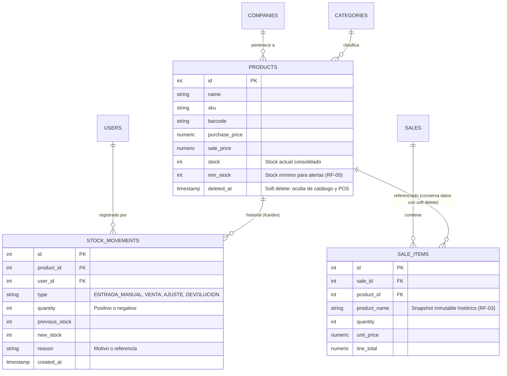

# Análisis de Requerimientos Funcionales - Módulo de Inventario

**Proyecto:** Sistema POS Multi-tenant (Tesis)  
**Fecha:** 4 de Octubre de 2026 (Actualizado con Aclaración sobre RF-03)  
**Documento:** `docs/analisis-requerimientos-inventario.md`  
**Estado General del Módulo:** En desarrollo (Cumplimiento parcial con brechas de trazabilidad y búsqueda)

---

## 1. Resumen Ejecutivo

El presente documento expone el análisis técnico detallado y contrastado contra el código fuente (`proyecto-uni-pos-back` y `proyecto-uni-pos-front`) respecto a los ocho (8) requerimientos funcionales definidos para el **Módulo de Inventario**.

### Aclaración de Negocio sobre RF-03 (Eliminación / Soft Delete)
> [!IMPORTANT]
> **Definición de "Eliminar" en el POS:**  
> La eliminación de productos en el sistema es **estrictamente un Borrado Lógico (`softDelete`)**. 
> - **Catálogo activo / POS:** Un producto eliminado **no debe aparecer** en la vista de inventario activo ni debe ser seleccionable en el punto de venta para generar nuevas ventas.
> - **Ventas, Facturas y Reportes:** Al consultar ventas pasadas, imprimir facturas/comprobantes PDF o revisar cierres de caja, la información del producto (**nombre, precio histórico, IVA, cantidades**) **debe mostrarse con total integridad y claridad**. Nunca debe verse `null` ni romperse la relación histórica.

### Cuadro Resumen de Cumplimiento

| ID | Requerimiento Funcional | Estado | Backend | Frontend | Nivel de Riesgo |
|---|---|:---:|:---:|:---:|:---:|
| **RF-01** | Registrar nuevo producto (nombre, precio, stock inicial) | **CUMPLE** | Implementado | Implementado | Bajo |
| **RF-02** | Modificar información de producto existente | **CUMPLE PARCIAL** | Implementado | Incompleto (sin categoría ni imagen) | Medio |
| **RF-03** | Eliminar productos del inventario (Soft Delete con integridad histórica) | **CUMPLE PARCIAL / AJUSTE UX Y SNAPSHOTS** | Implementado `softDelete` | Diálogo funcional, falta aclarar baja vs borrado | **Bajo / Medio (Integridad histórica)** |
| **RF-04** | Ingresos manuales de stock a productos existentes | **NO CUMPLE** | Sin endpoint ni entidad de movimientos | Sin interfaz de entrada/ajuste | **Medio / Alto** |
| **RF-05** | Alertas visuales cuando producto esté bajo stock mínimo | **CUMPLE PARCIAL** | Falta `minStock` en `Product` | Solo en Reportes con umbral global | Medio |
| **RF-06** | Buscar productos por nombre, categoría o código | **NO CUMPLE** | Sin parámetros de búsqueda | Sin barra de búsqueda en módulo | **Alto (Usabilidad)** |
| **RF-07** | Listado actualizado de todos los productos disponibles | **CUMPLE** | Implementado | Implementado (Grid Reactivo) | Bajo |
| **RF-08** | Historial de movimientos de inventario por producto (Kardex) | **NO CUMPLE** | Inexistente (no hay entidad/tabla) | Inexistente | **Alto (Auditoría/Control)** |

---

## 2. Análisis Detallado por Requerimiento Funcional

```
                                  MAPA DE ESTADO DE REQUERIMIENTOS
┌────────────────────────────────────────────────────────────────────────────────────────┐
│  [RF-01] Registrar Producto:        [CUMPLE]              (Backend OK / Frontend OK)   │
│  [RF-02] Modificar Producto:        [CUMPLE PARCIAL]      (Falta Categoría e Imagen)   │
│  [RF-03] Eliminar Producto (Soft):  [CUMPLE PARCIAL]      (Requiere garantía histórico)│
│  [RF-04] Ingreso Manual de Stock:   [NO CUMPLE]           (Solo sobrescritura directa) │
│  [RF-05] Alerta Stock Mínimo:       [CUMPLE PARCIAL]      (Solo en reportes, sin campo)│
│  [RF-06] Búsqueda (Nombre/Cat/Cod): [NO CUMPLE]           (Sin búsqueda en catálogo)   │
│  [RF-07] Listado Actualizado:       [CUMPLE]              (Cards Grid reactivo)        │
│  [RF-08] Historial Movimientos:     [NO CUMPLE]           (Sin Kardex ni entidad)      │
└────────────────────────────────────────────────────────────────────────────────────────┘
```

---

### RF-01: El sistema debe permitir registrar un nuevo producto con nombre, precio y stock inicial

* **Estado:** **CUMPLE**
* **Archivos Backend:**
  - `proyecto-uni-pos-back/src/modules/products/entities/product.entity.ts`
  - `proyecto-uni-pos-back/src/modules/products/dto/create-product.dto.ts`
  - `proyecto-uni-pos-back/src/modules/products/products.controller.ts` (Línea 45: `@Post('create')`)
  - `proyecto-uni-pos-back/src/modules/products/products.service.ts` (Líneas 211-221)
* **Archivos Frontend:**
  - `proyecto-uni-pos-front/src/components/products/CreateProductDialog.tsx`
  - `proyecto-uni-pos-front/src/services/products.ts` (Líneas 64-71, 82-93)
  - `proyecto-uni-pos-front/src/hooks/useProducts.ts` (Líneas 148-167)
  - `proyecto-uni-pos-front/src/pages/store/products/ProductsPage.tsx` (Líneas 112-129)

#### Contraste con el Código
1. **Backend:** El DTO `CreateProductDto` incluye `name`, `purchasePrice`, `salePrice`, `stock`, `taxExempt`, `image`, `sku`, `barcode`, `companyId`, `storeId`.
   ```typescript
   // products.service.ts
   async createProduct(dto: CreateProductDto) {
       const newProduct = this.productRepository.create({
           ...dto,
           company: { id: Number(dto.companyId) },
       });
       const savedProduct = await this.productRepository.save(newProduct);
       return { message: 'Producto creado correctamente', product: savedProduct };
   }
   ```
2. **Frontend:** El formulario en `CreateProductDialog.tsx` solicita obligatoriamente: Nombre, Precio de Compra, Precio de Venta, Stock y Link de la Imagen.

#### Hallazgos y Observaciones
- **Cumplimiento funcional:** Se pueden ingresar el nombre, ambos precios y el stock inicial.
- **Categoría omitida en creación manual:** Aunque la entidad `Product` soporta `category_id` (y la carga masiva CSV sí crea/asigna categorías), la creación manual de producto (`CreateProductDto` y `CreateProductDialog`) no incluye el selector de categoría.
- **Imagen obligatoria en UI:** En `CreateProductDialog.tsx`, el campo `image` es obligatorio (`required: "El link de la imagen es requerido"`). Si el usuario no cuenta con una URL de imagen, el registro se bloquea.
- **Trazabilidad:** El stock inicial se almacena de forma plana en la columna `products.stock`. No se registra un movimiento inicial de entrada en el inventario.

---

### RF-02: El sistema debe permitir modificar la información de un producto existente

* **Estado:** **CUMPLE PARCIALMENTE**
* **Archivos Backend:**
  - `proyecto-uni-pos-back/src/modules/products/dto/update-product.dto.ts`
  - `proyecto-uni-pos-back/src/modules/products/products.controller.ts` (Línea 40: `@Patch('update')`)
  - `proyecto-uni-pos-back/src/modules/products/products.service.ts` (Líneas 185-209)
* **Archivos Frontend:**
  - `proyecto-uni-pos-front/src/components/products/ProductFormDialog.tsx`
  - `proyecto-uni-pos-front/src/pages/store/products/ProductsPage.tsx` (Líneas 62-82)
  - `proyecto-uni-pos-front/src/hooks/useProducts.ts` (Líneas 52-80)

#### Contraste con el Código
1. **Backend:** El endpoint `@Patch('update')` recibe `UpdateProductDto` con `id`, `name`, `sku`, `barcode`, `purchasePrice`, `salePrice`, `taxExempt` y `stock`.
   ```typescript
   // products.service.ts
   async updateProduct(dto: UpdateProductDto) {
       if (!dto.id) throw new Error('El id del producto es obligatorio');
       const existingProduct = await this.productRepository.findOne({ where: { id: dto.id } });
       if (!existingProduct) throw new Error(`No se encontró el producto con id ${dto.id}`);
       Object.assign(existingProduct, dto);
       const updated = await this.productRepository.save(existingProduct);
       return { message: 'Producto actualizado correctamente', product: updated };
   }
   ```
2. **Frontend:** `ProductFormDialog.tsx` se pre-carga con los datos del producto seleccionado (`name`, `sku`, `barcode`, `purchasePrice`, `salePrice`, `stock`, `taxExempt`).

#### Hallazgos y Observaciones
- **Campos faltantes en la edición:** Ni `UpdateProductDto` ni `ProductFormDialog.tsx` permiten editar la `image` ni la `category`. Si un producto fue registrado con un enlace erróneo de imagen o sin categoría, el usuario no puede corregirlo desde la interfaz.
- **Modificación arbitraria de stock:** Al permitir la modificación libre del valor de `stock` en este formulario sin pedir justificación ni registrar un ajuste de inventario, se pierde la auditoría del cambio en existencias.

---

### RF-03: El sistema debe permitir eliminar productos del inventario (Soft Delete con integridad histórica en ventas y facturas)

* **Estado:** **CUMPLE PARCIALMENTE / REQUIERE GARANTIZAR VISIBILIDAD HISTÓRICA**
* **Archivos Backend:**
  - `proyecto-uni-pos-back/src/modules/products/products.controller.ts` (Línea 50: `@Delete('delete/:id')`)
  - `proyecto-uni-pos-back/src/modules/products/products.service.ts` (Líneas 223-239)
  - `proyecto-uni-pos-back/src/modules/sales/sales.service.ts` (Líneas 48, 106)
  - `proyecto-uni-pos-back/src/modules/sales/entities/sale-items.entity.ts`
* **Archivos Frontend:**
  - `proyecto-uni-pos-front/src/components/products/DeleteProductDialog.tsx`
  - `proyecto-uni-pos-front/src/components/sales/SalesCardsGrid.tsx`
  - `proyecto-uni-pos-front/src/utils/saleReceiptPdf.ts`

#### Contraste con el Código
1. **Mecanismo de Borrado en Backend:**
   En `ProductsService.deleteProduct`:
   ```typescript
   async deleteProduct(id: number) {
       try {
           const product = await this.productRepository.findOne({ where: { id } });
           if (!product) throw new Error(`No se encontró el producto con id ${id}`);

           // Marca el producto como eliminado (soft delete)
           await this.productRepository.softDelete(id);

           return { message: `Producto con id ${id} eliminado correctamente.` };
       } catch (error) {
           console.error('ERROR AL ELIMINAR PRODUCTO', error);
           throw new Error('Error al eliminar producto');
       }
   }
   ```
   - El código ya utiliza `softDelete` con la columna `@DeleteDateColumn() deletedAt` de TypeORM en lugar de `delete()` físico.
   - Esto significa que la fila del producto en la tabla `sys.products` **nunca se borra de la base de datos**, conservando su `id`, `name`, `sku`, etc.

2. **Comportamiento en Consultas de Ventas y Facturas:**
   - En `sales.service.ts` (`getAllSales`), se hace un `leftJoin('products', 'p', 'p.id = si.product_id')` directamente con la tabla. Al no filtrar explícitamente `p.deleted_at IS NULL`, la consulta recupera correctamente el `product_name` para ventas históricas.
   - En `reports.service.ts` (Reporte de más vendidos), se usa `.withDeleted()`, lo que preserva el cálculo de productos vendidos aunque estén dados de baja.

3. **Comportamiento en Catálogo Activo y Punto de Venta:**
   - En `getAllProducts`, TypeORM excluye automáticamente los registros que tengan `deleted_at`, por lo que el producto **desaparece del catálogo de productos**.
   - En `ProductSelector.tsx` (Punto de Venta), al alimentarse de los productos activos, el producto eliminado no puede ser seleccionado para nuevas ventas.

#### Hallazgos y Puntos de Atención
- **Vulnerabilidad de Snapshot en `SaleItem`:**
  - La entidad `SaleItem` solo guarda `product_id: number`. **No almacena el nombre del producto en el momento de la venta**.
  - Si en el futuro un producto se renombrara antes de ser dado de baja, las facturas pasadas reflejarían el nombre nuevo en lugar del histórico.
  - Para blindar 100% las facturas y recibos fiscales, la buena práctica es almacenar `product_name` como snapshot inmutable en `sale_items`.
- **Experiencia de Usuario en Frontend (`DeleteProductDialog.tsx`):**
  - El mensaje actual dice: *"¿Estás seguro de que deseas eliminar el producto...? Esta acción no se puede deshacer."*
  - Debería comunicar con precisión: *"El producto se dará de baja del catálogo activo y no podrá seguir vendiéndose. La información histórica en ventas, reportes y facturas previas se mantendrá intacta."*

---

### RF-04: El sistema debe permitir realizar ingresos manuales de stock a productos existentes

* **Estado:** **NO CUMPLE**
* **Archivos Backend:**
  - Inexistente (no hay endpoint tipo `@Post(':id/stock-entry')` o `@Post('stock/adjustment')`).
* **Archivos Frontend:**
  - Inexistente (no existe modal ni botón para "Ingreso de Mercancía" o "Ajuste de Stock").

#### Contraste con el Código
- No existe ningún flujo específico de **ingreso manual de stock** (recepción de mercancía, compra local, devolución o ajuste).
- La única forma en que un usuario puede alterar el stock en el sistema actual es:
  1. Abriendo el modal general de **Edición de Producto** (`ProductFormDialog.tsx`).
  2. Sobrescribiendo manualmente el número en el campo `Stock` (e.g. calcular mentalmente 12 + 10 y escribir 22).
  3. O ejecutando una venta en `sales.service.ts` (que resta stock).

#### Hallazgos y Observaciones
- **Falta de concepto transaccional:** Un "ingreso de stock" debe ser una operación aditiva (`stock_actual + cantidad_ingresada`), típicamente acompañada de:
  - Cantidad a ingresar.
  - Costo unitario del ingreso (opcional pero deseable).
  - Motivo / Justificación (Compra a proveedor, ajuste por conteo, etc.).
  - Documento de referencia / factura de compra.
- Reemplazar el stock mediante un `PATCH` general no cumple con las buenas prácticas operativas de un POS ni con el propósito de este requerimiento funcional.

---

### RF-05: El sistema debe mostrar alertas visuales cuando un producto esté por debajo del stock mínimo

* **Estado:** **CUMPLE PARCIALMENTE (DESACOPLADO DEL CATÁLOGO)**
* **Archivos Backend:**
  - `proyecto-uni-pos-back/src/modules/products/entities/product.entity.ts`
  - `proyecto-uni-pos-back/src/modules/reports/reports.service.ts` (Líneas 207-245)
  - `proyecto-uni-pos-back/src/modules/reports/reports.controller.ts` (Líneas 44-55)
* **Archivos Frontend:**
  - `proyecto-uni-pos-front/src/components/products/ProductsCardsGrid.tsx` (Líneas 120-126)
  - `proyecto-uni-pos-front/src/pages/store/reports/InventoryReportsPage.tsx` (Líneas 124-139)

#### Contraste con el Código
1. **Entidad `Product` sin `minStock`:** La tabla `products` no cuenta con una columna `min_stock` ni `stock_minimo`.
2. **Pantalla Principal de Productos (`ProductsCardsGrid.tsx`):**
   ```tsx
   <div className="flex items-center justify-between text-sm">
       <span className="text-muted-foreground">Stock:</span>
       <span className={cn(
           "font-semibold",
           product.stock > 0 ? "text-foreground" : "text-destructive"
       )}>
           {product.stock} unidades
       </span>
   </div>
   ```
   Solo evalúa `product.stock > 0` (cambia a rojo si es 0). **No existe alerta de stock mínimo** en el catálogo de productos.
3. **Módulo de Reportes (`InventoryReportsPage.tsx`):**
   Aquí **sí existe una alerta visual**:
   ```tsx
   {row.isLowStock && (
       <span className="inline-flex items-center gap-1 px-2.5 py-0.5 rounded-full text-xs font-medium bg-red-100 text-red-800">
           <AlertCircle className="h-3 w-3" />
           Bajo Stock
       </span>
   )}
   ```
   Sin embargo, este reporte evalúa `p.stock <= lowStockThreshold`, donde `lowStockThreshold` es un parámetro global del filtro (por defecto 5 unidades), no un umbral configurado por producto.

#### Hallazgos y Observaciones
- Las alertas visuales existen, pero están relegadas al submódulo de **Reportes** (`/store/reports/inventory`).
- El administrador o cajero no recibe ninguna notificación ni indicador visual de advertencia temprana (e.g. badge amarillo/naranja cuando `stock <= min_stock`) en la pantalla de gestión diaria de productos ni en el punto de venta.

---

### RF-06: El sistema debe permitir buscar productos por nombre, categoría o código

* **Estado:** **NO CUMPLE (EN EL MÓDULO DE INVENTARIO)**
* **Archivos Backend:**
  - `proyecto-uni-pos-back/src/modules/products/products.service.ts` (Líneas 21-29)
  - `proyecto-uni-pos-back/src/modules/products/dto/get-all-products.dto.ts`
* **Archivos Frontend:**
  - `proyecto-uni-pos-front/src/components/products/ProductsHeader.tsx`
  - `proyecto-uni-pos-front/src/components/products/ProductsCardsGrid.tsx`
  - `proyecto-uni-pos-front/src/pages/store/products/ProductsPage.tsx`
  - `proyecto-uni-pos-front/src/components/sales/ProductSelector.tsx` (Líneas 37-46)
  - `proyecto-uni-pos-front/src/hooks/useProductSelection.ts` (Líneas 20-24)

#### Contraste con el Código
1. **Módulo de Productos / Inventario (`ProductsPage.tsx`):**
   - En `ProductsHeader.tsx` no existe ningún `<Input />` de búsqueda. Solo están los botones "Actualizar", "Cargar Productos" y "Crear Producto".
   - En `ProductsCardsGrid.tsx` se renderiza directamente la lista completa sin capacidad de filtrado.
   - El backend `getAllProducts` solo filtra por `companyId` y `storeId`.
2. **Módulo de Ventas (`ProductSelector.tsx`):**
   - Sí incluye un input de búsqueda, pero su filtro es parcial:
   ```typescript
   // useProductSelection.ts
   const filteredProducts = useMemo(() => {
     return products.filter(product =>
       product.name.toLowerCase().includes(productSearchTerm.toLowerCase())
     );
   }, [products, productSearchTerm]);
   ```
   Solo busca por `name`. Ignora por completo el código de barras (`barcode`), el `sku` y la `category`.

#### Hallazgos y Observaciones
- **Grave deficiencia de usabilidad:** En el inventario no se puede filtrar ni buscar un producto. Si un establecimiento cuenta con 500 productos, el usuario debe desplazarse manualmente por todo el grid para localizar un artículo.
- No se cumple la búsqueda multi-criterio requerida (Nombre + Categoría + Código/Barcode/SKU).

---

### RF-07: El sistema debe mostrar un listado actualizado de todos los productos disponibles

* **Estado:** **CUMPLE**
* **Archivos Backend:**
  - `proyecto-uni-pos-back/src/modules/products/products.service.ts` (Líneas 21-29)
* **Archivos Frontend:**
  - `proyecto-uni-pos-front/src/pages/store/products/ProductsPage.tsx`
  - `proyecto-uni-pos-front/src/components/products/ProductsCardsGrid.tsx`
  - `proyecto-uni-pos-front/src/hooks/useProducts.ts`

#### Contraste con el Código
1. **Backend:**
   ```typescript
   async getAllProducts(dto: GetAllProductsDto) {
       const query = this.productRepository
           .createQueryBuilder('product')
           .innerJoin('product.company', 'company')
           .where('company.id = :companyId', { companyId: dto.companyId })
           .andWhere('product.store_id = :storeId', { storeId: dto.storeId });

       return await query.getMany();
   }
   ```
2. **Frontend:**
   - La pantalla `ProductsPage.tsx` llama a `methods.getAllProducts(companyId, storeId)` al cargar.
   - Cuenta con botón "Actualizar" que refresca la lista con animación de spinner.
   - Al registrar, editar o eliminar un producto, el estado local de React se sincroniza automáticamente (`useProducts.ts`).
   - Muestra detalles clave en cada tarjeta: imagen, nombre, SKU, precios compra/venta, unidades en stock, código de barras y estado de impuestos.

#### Hallazgos y Observaciones
- **Cumplimiento general óptimo.**
- **Mejora técnica pendiente:** `getAllProducts` no tiene paginación. Si el catálogo crece significativamente (ej. más de 2,000 referencias), se transferirá un payload pesado en cada petición.

---

### RF-08: El sistema debe permitir visualizar el historial de movimientos de inventario por producto

* **Estado:** **NO CUMPLE (MÓDULO INEXISTENTE)**
* **Archivos Backend:**
  - Inexistente (no existe entidad `StockMovement`, `ProductMovement` o `Kardex`).
* **Archivos Frontend:**
  - Inexistente (no existe pantalla ni diálogo para historial de movimientos de productos).

#### Contraste con el Código
- Al analizar las entidades del backend (`find proyecto-uni-pos-back/src -name "*.entity.ts"`):
  - Existen `Sale`, `SaleItem`, `Product`, `BonusTransaction` (que registra el movimiento de puntos/saldo de bonificaciones de clientes).
  - **No existe ninguna tabla de movimientos de inventario**.
- Cuando ocurre una venta en `sales.service.ts` (líneas 366-370):
  ```typescript
  for (const product of createSaleDto.products) {
      const productEntity = productEntitiesMap.get(product.id)!;
      productEntity.stock = productEntity.stock - product.quantity;
      await queryRunner.manager.save(Product, productEntity);
  }
  ```
  El stock simplemente se decrementa en la fila del producto. No queda registro de tipo de movimiento (`SALIDA_VENTA`), cantidad previa, cantidad resultante, fecha, usuario responsable ni referencia al documento.

#### Hallazgos y Observaciones
- **Falta total de trazabilidad / Kardex:** Es imposible responder preguntas operativas básicas como:
  - *¿Cuándo y quién alteró el stock de este producto?*
  - *¿Por qué el stock pasó de 15 a 5 unidades?*
  - *¿Cuáles fueron las entradas y salidas de mercancía en el último mes?*

---

## 3. Matriz Comparativa y Hallazgos Principales

| Requerimiento Funcional | Cumple Especificación | Nivel de Madurez | Principales Deficiencias Encontradas |
|---|:---:|:---:|---|
| **RF-01: Registro de producto** | Sí | 90% | Campo `image` obligatorio en UI; no permite asociar categoría al crear de forma manual. |
| **RF-02: Modificar producto** | Parcial | 65% | Formulario no incluye edición de categoría ni de imagen; edición de stock sin trazabilidad. |
| **RF-03: Eliminar producto (Soft Delete)** | Parcial | 80% | El backend ya hace `softDelete`, pero se debe blindar la inmutabilidad histórica del comprobante (`product_name` snapshot) y ajustar el copy en UI. |
| **RF-04: Ingreso manual stock** | No | 0% | No existe endpoint ni UI para recepcionar mercancía; se recurre a sobrescribir el stock total. |
| **RF-05: Alerta stock mínimo** | Parcial | 40% | La entidad `Product` no tiene campo `minStock`; las alertas solo existen en Reportes bajo umbral global. |
| **RF-06: Búsqueda (Nombre/Cat/Cod)** | No | 15% | No existe buscador en la página de Productos. En Ventas solo busca por nombre exacto. |
| **RF-07: Listado actualizado** | Sí | 95% | Funciona correctamente con sincronización de estado, sin paginación en backend. |
| **RF-08: Historial movimientos** | No | 0% | **Crítico:** No existe modelo de Kardex ni auditoría de movimientos de stock. |

---

## 4. Diagrama del Modelo Propuesto con Soft Delete y Trazabilidad



---

## 5. Plan de Acción Modificado (Roadmap de Implementación)

### Prioridad 1: Usabilidad y Blindaje de Integridad Histórica (Corto Plazo)
1. **Blindaje de Soft Delete e Integridad en Ventas/Facturas (RF-03):**
   - **Backend:**
     - Verificar y garantizar que todas las consultas de ventas históricas, facturas y reportes (`getAllSales`, `getSaleById`, `getSalesReport`) utilicen `.withDeleted()` o raw joins sin filtro de `deleted_at`, asegurando que el producto eliminado jamás retorne `null`.
     - Agregar a `SaleItem` la columna `product_name` como snapshot inmutable al momento de crear la venta.
   - **Frontend:**
     - En `DeleteProductDialog.tsx`: Actualizar el texto para clarificar que el producto se da de baja del inventario activo y que todas las facturas y ventas pasadas conservarán intacta su información.
     - Garantizar que el selector de ventas (`ProductSelector.tsx`) nunca muestre productos dados de baja.
2. **Barra de búsqueda multi-criterio en Productos (RF-06):**
   - Agregar un input de búsqueda y un selector de categoría en `ProductsHeader.tsx`.
   - Implementar filtrado reactivo en `ProductsPage.tsx` / `ProductsCardsGrid.tsx` por:
     - Nombre (`name`).
     - Código de barras (`barcode`).
     - SKU (`sku`).
     - Categoría (`category`).
   - Enriquecer `getAllProducts` del backend con `.leftJoinAndSelect('product.category', 'category')` para que la categoría esté disponible en el frontend.

### Prioridad 2: Alertas de Stock Mínimo y Enriquecimiento de Formularios (Medio Plazo)
1. **Campo `minStock` y Alertas Visuales (RF-05):**
   - Agregar la columna `@Column({ type: 'int', default: 5, name: 'min_stock' }) minStock: number;` a la entidad `Product`.
   - En `ProductsCardsGrid.tsx`, agregar un badge de advertencia condicional:
     - 🔴 `stock <= 0` (Sin Stock / Agotado).
     - 🟠 `stock <= product.minStock` (Stock Bajo).
     - 🟢 `stock > product.minStock` (Stock Normal).
2. **Completitud de Formularios (RF-01, RF-02):**
   - Agregar selector de categorías en `CreateProductDialog` y `ProductFormDialog`.
   - Permitir editar la imagen y el `minStock` en `ProductFormDialog`.
   - Hacer el campo `image` opcional con un placeholder por defecto.

### Prioridad 3: Kardex e Ingresos Manuales de Stock (Estructural)
1. **Entidad `StockMovement` (Kardex) (RF-08):**
   - Crear entidad `StockMovement` con campos: `productId`, `storeId`, `companyId`, `userId`, `type` (`INGRESO_MANUAL`, `VENTA`, `AJUSTE`), `quantity`, `previousStock`, `newStock`, `reason`.
   - Cada vez que se crea un producto, registrar el stock inicial en `StockMovement`.
   - En `sales.service.ts`, al decrementar stock en una venta, insertar el movimiento correspondiente tipo `VENTA`.
2. **Ingreso Manual de Stock (RF-04):**
   - Crear endpoint `POST /products/:id/stock-entry` que reciba `{ quantity, reason, costPrice }`.
   - Incrementar atómicamente el stock del producto y registrar el movimiento en el Kardex.
   - En el frontend, agregar botón/acción "Ingresar Stock" en cada tarjeta de producto.
3. **Pestaña / Diálogo de Historial de Movimientos (RF-08):**
   - Crear modal `ProductMovementsDialog.tsx` accesible desde la tarjeta del producto para visualizar la tabla cronológica de ingresos y egresos.
