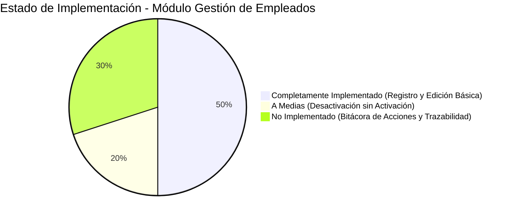

# Informe de Análisis Técnico: Módulo de Gestión de Empleados y Bitácora de Acciones

**Proyecto:** Sistema POS Multi-sucursal (Tesis POS)  
**Fecha:** 4 de Octubre de 2026  
**Documento:** `docs/informe-analisis-modulo-gestion-empleados.md`  
**Estado General del Módulo:** **Parcialmente Implementado (~55% de completitud)**

---

## 1. Resumen Ejecutivo

El presente informe contrasta directamente los requerimientos funcionales del **Módulo de Gestión de Empleados** contra el código fuente actual del repositorio tanto en Backend ([`proyecto-uni-pos-back`](file:///Users/jaimem/Dev/code/tesis/proyecto-uni-pos-back)) como en Frontend ([`proyecto-uni-pos-front`](file:///Users/jaimem/Dev/code/tesis/proyecto-uni-pos-front)).

### Descripción Oficial del Requerimiento:
> *"El sistema debe permitir la administración de los usuarios internos, incluyendo su registro, edición, activación o desactivación, así como el seguimiento de las acciones ejecutadas dentro del sistema, garantizando control y trazabilidad de las operaciones realizadas por el personal."*

### Diagnóstico Global:
1. **Registro de usuarios:** ✅ **Completamente implementado.** Existe soporte tanto a nivel de administración global del sistema (`Users - Admin`) como a nivel de administración de empresa/tienda (`Users - Store Admin`), con validación de unicidad, hash seguro de contraseñas, asignación de roles y membresías por compañía.
2. **Edición de usuarios:** ✅ **Completamente implementado para usuarios activos.** Permite actualizar nombres, emails, teléfonos, cédulas y reasignar roles dentro de la empresa.
3. **Activación / Desactivación de usuarios:** ⚠️ **A Medias (Asimétrico).** La desactivación (bloqueo lógico / soft-delete) está completamente funcional; sin embargo, **la reactivación/activación de usuarios desactivados no existe** ni en el backend ni en el frontend, a pesar de que el diálogo de confirmación promete explícitamente *"Podrás reactivarlo luego si es necesario"*.
4. **Registro de acciones / Bitácora:** ❌ **No Implementado (Crítico).** No existe un sistema centralizado de bitácora o auditoría (`sys.audit_logs`). Únicamente existen identificadores aislados de `user_id` en las tablas de ventas (`sys.sales`) y movimientos de inventario (`sys.stock_movements`), pero ninguna interfaz ni servicio permite auditar o visualizar las acciones del personal.

---

## 2. Matriz Comparativa: Requerimientos vs. Código

| Característica Asociada | Estado Actual | Backend | Frontend | Brecha / Hallazgo Crítico |
| :--- | :---: | :---: | :---: | :--- |
| **1. Registrar nuevos usuarios (empleados o administradores)** | ✅ **Completo (100%)** | Endpoints `/users/admin/create-user` y `/users/store/create-user` con transacciones atómicas. | Diálogo [`UserFormDialog.tsx`](file:///Users/jaimem/Dev/code/tesis/proyecto-uni-pos-front/src/components/users/UserFormDialog.tsx) con validaciones React Hook Form y selector reactivo de roles. | Ninguna funcional. El registro es robusto y separa privilegios super-admin vs. tienda. |
| **2. Editar información de usuarios registrados** | ✅ **Completo (90%)** | Endpoints `/users/admin/update-user` y `/users/store/update-user` reasignando roles y membresías. | Formulario prellenado en [`UserFormDialog.tsx`](file:///Users/jaimem/Dev/code/tesis/proyecto-uni-pos-front/src/components/users/UserFormDialog.tsx), bloqueando cambio de empresa según regla de negocio. | Solo funciona con usuarios activos. Un usuario desactivado arroja error 400 (`BadRequestException`) si se intenta editar. |
| **3. Activar o desactivar usuarios del sistema** | ⚠️ **A Medias (40%)** | **Desactivar:** Implementado con `deletedAt` e `isActive = false`.<br>**Activar:** **Inexistente** (no hay endpoint ni método). | **Desactivar:** Diálogo [`DeleteUserDialog.tsx`](file:///Users/jaimem/Dev/code/tesis/proyecto-uni-pos-front/src/components/users/DeleteUserDialog.tsx) funcional.<br>**Activar:** **Inexistente** (no hay botón ni acción de reactivación). | Imposibilidad técnica para reactivar un empleado dado de baja temporalmente sin entrar a la base de datos por SQL manual. |
| **4. Registrar acciones importantes realizadas por cada usuario (Bitácora)** | ❌ **No Implementado (15%)** | No existe entidad `sys.audit_logs` ni interceptores de auditoría.<br>*(Solo persistencia de `user_id` en ventas y kardex).* | No existe vista, tabla ni componente de bitácora o trazabilidad de empleados. | Falta absoluta de trazabilidad operativa y de seguridad (quién creó qué, quién modificó precios, quién dio de baja stock, login/logouts no auditables). |

---

## 3. Análisis Técnico Detallado por Característica

### Característica 1: Registro de Nuevos Usuarios (Empleados o Administradores)

#### Implementación en Backend:
* **Ubicación:** [`proyecto-uni-pos-back/src/modules/users/users.controller.ts`](file:///Users/jaimem/Dev/code/tesis/proyecto-uni-pos-back/src/modules/users/users.controller.ts#L91-L99) y [`users.service.ts`](file:///Users/jaimem/Dev/code/tesis/proyecto-uni-pos-back/src/modules/users/users.service.ts#L337-L459).
* **Endpoints:**
  * `POST /users/admin/create-user`: Exclusivo para administradores generales (requiere permiso `user_admin:create`). Permite especificar cualquier `companyId` y `roleId`.
  * `POST /users/store/create-user`: Exclusivo para administradores de tienda/empresa (requiere permiso `user:create`). Fuerza automáticamente el `companyId` al de la empresa del solicitante e impide asignar roles de otras empresas.
* **Flujo Transaccional:**
  Utiliza [`processTransaction`](file:///Users/jaimem/Dev/code/tesis/proyecto-uni-pos-back/src/database/transactions.ts) asegurando la integridad de tres tablas vinculadas:
  1. Inserción en `sys.users` con hash seguro bcrypt (`hashPassword`) y username autogenerado (`firstName.lastName.nationalId`).
  2. Inserción en `sys.user_roles` con estado `ACTIVE`.
  3. Inserción en `sys.user_company_memberships` con estado `isActive: true`.
* **Validaciones:** Comprobación estricta de unicidad previa de `email`, `nationalId` y `username`.

#### Implementación en Frontend:
* **Ubicación:** [`proyecto-uni-pos-front/src/components/users/UserFormDialog.tsx`](file:///Users/jaimem/Dev/code/tesis/proyecto-uni-pos-front/src/components/users/UserFormDialog.tsx), [`AdminUsersPage.tsx`](file:///Users/jaimem/Dev/code/tesis/proyecto-uni-pos-front/src/pages/admin/AdminUsersPage.tsx) y [`StoreUsersPage.tsx`](file:///Users/jaimem/Dev/code/tesis/proyecto-uni-pos-front/src/pages/store/StoreUsersPage.tsx).
* **Comportamiento:**
  * Modal reactivo con control de errores mediante `react-hook-form`.
  * Carga dinámica de roles filtrados según la empresa seleccionada (`onFetchRoles(companyId)`).
  * Validación visual en tiempo real de campos obligatorios y formato de correo electrónico.

---

### Característica 2: Edición de Información de Usuarios Registrados

#### Implementación en Backend:
* **Ubicación:** [`proyecto-uni-pos-back/src/modules/users/users.controller.ts`](file:///Users/jaimem/Dev/code/tesis/proyecto-uni-pos-back/src/modules/users/users.controller.ts#L102-L110) y [`users.service.ts`](file:///Users/jaimem/Dev/code/tesis/proyecto-uni-pos-back/src/modules/users/users.service.ts#L461-L664).
* **Endpoints:**
  * `PATCH /users/admin/update-user` (permiso `user_admin:update`).
  * `PATCH /users/store/update-user` (permiso `user:update`).
  * `PATCH /users/me/update` (permite al usuario editar su propio perfil).
* **Manejo de Roles y Membresías:**
  Si se actualiza el `roleId`, el sistema desactiva (`status: DESACTIVE`, `deletedAt = now()`) las asignaciones anteriores en `sys.user_roles` y crea o reactiva la nueva tupla.
  Si se actualiza el `companyId`, se desactivan las membresías en otras compañías y se asocia la nueva.
* **Punto Débil Detectado:**
  En la línea 476 de `users.service.ts`:
  ```typescript
  const user = await this.users.findOne({
      where: { id: id_user },
      withDeleted: false, // <-- Excluye usuarios desactivados
  });
  if (!user) throw new BadRequestException('El usuario no existe');
  ```
  Esto significa que un usuario en estado inactivo no puede ser editado ni corregido administrativamente.

#### Implementación en Frontend:
* **Ubicación:** Botón con icono de lápiz en [`UsersTable.tsx`](file:///Users/jaimem/Dev/code/tesis/proyecto-uni-pos-front/src/components/users/UsersTable.tsx#L118-L127).
* Prellena el modal excluyendo la contraseña.
* Deshabilita el selector de empresa (`disabled={user !== null}`) para preservar la consistencia organizacional de la membresía.

---

### Característica 3: Activar o Desactivar Usuarios del Sistema

#### Lo que está presente (Desactivación / Baja Lógica):
* **Backend:**
  * Endpoints `DELETE /users/admin/delete-user` y `DELETE /users/store/delete-user`.
  * Aplica un soft-delete híbrido sobre [`User`](file:///Users/jaimem/Dev/code/tesis/proyecto-uni-pos-back/src/core/users/user.entity.ts):
    ```typescript
    userToDelete.deletedAt = new Date();
    userToDelete.updatedAt = new Date();
    userToDelete.isActive = false;
    await this.users.save(userToDelete);
    ```
  * En autenticación ([`auth.service.ts`](file:///Users/jaimem/Dev/code/tesis/proyecto-uni-pos-back/src/modules/auth/auth.service.ts#L50) y [`jwt.strategy.ts`](file:///Users/jaimem/Dev/code/tesis/proyecto-uni-pos-back/src/modules/auth/strategies/jwt.strategy.ts#L53)): si `user.isActive === false`, el login es rechazado y cualquier token existente es invalidado de inmediato.
* **Frontend:**
  * Columna de Estado con componente [`StatusBadge`](file:///Users/jaimem/Dev/code/tesis/proyecto-uni-pos-front/src/components/permissions/StatusBadge.tsx) en [`UsersTable.tsx`](file:///Users/jaimem/Dev/code/tesis/proyecto-uni-pos-front/src/components/users/UsersTable.tsx#L104).
  * Diálogo modal de confirmación [`DeleteUserDialog.tsx`](file:///Users/jaimem/Dev/code/tesis/proyecto-uni-pos-front/src/components/users/DeleteUserDialog.tsx).

#### Lo que FALTA (Activación / Reactivación):
* **Backend:**
  1. **Inexistencia de endpoint:** No hay ninguna ruta tipo `PATCH /users/admin/activate-user` o `POST /users/admin/restore-user`.
  2. **Inexistencia de método de servicio:** En [`UserService`](file:///Users/jaimem/Dev/code/tesis/proyecto-uni-pos-back/src/modules/users/users.service.ts) no hay función que restaure un usuario (`deletedAt = null`, `isActive = true`).
  3. **DTOs incompletos:** Ni [`UpdateDto`](file:///Users/jaimem/Dev/code/tesis/proyecto-uni-pos-back/src/modules/users/dtos/update.dto.ts) ni [`UpdateUserWithRoleDto`](file:///Users/jaimem/Dev/code/tesis/proyecto-uni-pos-back/src/modules/users/dtos/update-user-with-role.dto.ts) reciben la propiedad booleana `isActive`.
  4. Si se intenta "actualizar" un usuario inactivo para reactivarlo, el backend responde con error 400 porque busca con `withDeleted: false`.
* **Frontend:**
  1. La interfaz [`DeleteUserDialog.tsx`](file:///Users/jaimem/Dev/code/tesis/proyecto-uni-pos-front/src/components/users/DeleteUserDialog.tsx#L35) le asegura al usuario: *"Podrás reactivarlo luego si es necesario"*, pero **no proporciona ningún botón, switch ni opción para hacerlo**.
  2. En la tabla de usuarios ([`UsersTable.tsx`](file:///Users/jaimem/Dev/code/tesis/proyecto-uni-pos-front/src/components/users/UsersTable.tsx)), si un usuario está inactivo (`isActive: false`), los únicos botones visibles siguen siendo el de editar (que falla) y el de eliminar (que vuelve a desactivar). No hay botón de reactivación (icono de check o "Reactivar").
  3. Ni [`UsersAdminService`](file:///Users/jaimem/Dev/code/tesis/proyecto-uni-pos-front/src/services/users.admin.service.ts) ni [`UsersStoreService`](file:///Users/jaimem/Dev/code/tesis/proyecto-uni-pos-front/src/services/users.store.service.ts) tienen declarados métodos `activateUser`.

---

### Característica 4: Registro de Acciones Importantes / Bitácora de Usuarios

#### Situación Actual en el Código:
El requerimiento exige:
> *"El sistema debe registrar las acciones importantes realizadas por cada usuario (bitácora) ... garantizando control y trazabilidad de las operaciones realizadas por el personal."*

Al auditar la totalidad del backend y frontend, se constata lo siguiente:

1. **Inexistencia de Modelo de Bitácora:**
   No existe una tabla o entidad TypeORM de auditoría (por ejemplo `sys.audit_logs` o `sys.action_logs`).
2. **Inexistencia de Interceptor / Logger de Trazabilidad:**
   No existe un interceptor global o mecanismo AOP (Aspect-Oriented Programming) que capture quién realizó operaciones de mutación (creaciones, modificaciones de precios, eliminaciones, cambios de roles, transferencias de inventario, etc.).
3. **Trazabilidad Aislada (Lo único que existe actualmente):**
   * En [`Sale`](file:///Users/jaimem/Dev/code/tesis/proyecto-uni-pos-back/src/modules/sales/entities/sale.entity.ts#L27): campo `user_id` (guarda qué cajero procesó la venta).
   * En [`StockMovement`](file:///Users/jaimem/Dev/code/tesis/proyecto-uni-pos-back/src/modules/products/entities/stock-movement.entity.ts#L33): campo `user_id` (guarda qué empleado registró un ingreso o ajuste de inventario).
   * En [`Session`](file:///Users/jaimem/Dev/code/tesis/proyecto-uni-pos-back/src/modules/auth/entities/session.entity.ts): campos `login_at`, `logout_at`, `ip`, `user_agent`, `revoked_at`, `revoked_reason`. No obstante, esta tabla se utiliza únicamente para validación de tokens JWT en cada request y no cuenta con APIs para visualización de historial.
4. **Ausencia Total en Frontend:**
   * No existe ninguna pantalla de bitácora (`/audit`, `/admin/audit` o `/reports/audit`).
   * No hay forma de consultar desde la interfaz qué acciones ejecutó un empleado específico en un rango de fechas.

---

## 4. Clasificación de Brechas (Gaps) y Riesgos para la Tesis



### Riesgos Identificados:
1. **Riesgo Operativo - Bloqueo Irreversible de Empleados (Severidad: Alta):**
   Si un administrador desactiva por error a un cajero o encargado de tienda, no tiene forma de reactivarlo desde el panel. Obliga a intervención manual directa en la base de datos de producción mediante `psql` / pgAdmin (`UPDATE sys.users SET is_active = true, deleted_at = NULL WHERE id = '...'`).
2. **Riesgo de Evaluación de Tesis - Incumplimiento de Requerimiento Funcional (Severidad: Alta):**
   Los requerimientos explícitamente citan:
   * *"activación o desactivación"*
   * *"seguimiento de las acciones ejecutadas dentro del sistema, garantizando control y trazabilidad (bitácora)"*
   Durante la sustentación o prueba de software de la tesis, la carencia de una bitácora y la imposibilidad de reactivar usuarios constituirán una no-conformidad directa.
3. **Riesgo de Seguridad y Fraude (Severidad: Media-Alta):**
   Al no haber bitácora de auditoría sobre quién modifica productos, precios, anula ventas o cambia roles, el sistema carece de repudio en caso de discrepancias financieras o de inventario en las tiendas.

---

## 5. Plan de Acción y Solución Técnica Propuesta

Para completar el módulo al 100% de manera limpia, escalable y siguiendo las mejores prácticas del proyecto (NestJS + TypeORM + React + Tailwind + PNPM):

### Fase 1: Completar la Activación / Reactivación de Usuarios (Prioridad 1)

#### 1.1 Backend:
1. **Crear endpoint de activación:**
   * En [`UsersController`](file:///Users/jaimem/Dev/code/tesis/proyecto-uni-pos-back/src/modules/users/users.controller.ts):
     * `PATCH /users/admin/activate-user`: protegido con `RequirePermissions(['user_admin:update'])`.
     * `PATCH /users/store/activate-user`: protegido con `RequirePermissions(['user:update'])`.
   * En [`UserService`](file:///Users/jaimem/Dev/code/tesis/proyecto-uni-pos-back/src/modules/users/users.service.ts):
     * Método `activateUserAdmin({ id_user })`:
       ```typescript
       const user = await this.users.findOne({ where: { id: id_user }, withDeleted: true });
       if (!user) throw new BadRequestException('Usuario no encontrado');
       user.isActive = true;
       user.deletedAt = null;
       user.updatedAt = new Date();
       await this.users.save(user);
       ```
     * Método `activateStoreUser({ id_user }, requesterId)` con validación de compañía.
2. **Permitir edición de usuarios inactivos o habilitar el flag `isActive`:**
   * Si se desea editar o reactivar vía update, cambiar `withDeleted: false` por `withDeleted: true` en `updateUserWithRole` cuando aplique, o añadir `isActive?: boolean` en `UpdateUserWithRoleDto`.

#### 1.2 Frontend:
1. **Actualizar Servicios y Hooks:**
   * Agregar `activateUser(dto: { id_user: string })` en [`UsersAdminService`](file:///Users/jaimem/Dev/code/tesis/proyecto-uni-pos-front/src/services/users.admin.service.ts) y [`UsersStoreService`](file:///Users/jaimem/Dev/code/tesis/proyecto-uni-pos-front/src/services/users.store.service.ts).
   * Exponer la función en `useAdminUsers` y `useStoreUsers`.
2. **Actualizar [`UsersTable.tsx`](file:///Users/jaimem/Dev/code/tesis/proyecto-uni-pos-front/src/components/users/UsersTable.tsx):**
   * En la columna de acciones: si `user.isActive === true`, mostrar botón de desactivar (icono Trash o Ban). Si `user.isActive === false`, mostrar botón de reactivar (icono RotateCcw o CheckCircle con tooltip "Reactivar Usuario").
3. **Crear Modal o Diálogo de Reactivación:**
   * Confirmación rápida: *"¿Deseas reactivar al usuario X para que pueda volver a iniciar sesión?"*.

---

### Fase 2: Implementación de la Bitácora de Acciones (Auditoría) (Prioridad 2)

#### 2.1 Backend:
1. **Crear Entidad de Auditoría `sys.audit_logs`:**
   ```typescript
   @Entity({ schema: 'sys', name: 'audit_logs' })
   export class AuditLog {
       @PrimaryGeneratedColumn('uuid') id: string;
       @Column({ name: 'user_id', type: 'uuid', nullable: true }) userId?: string;
       @ManyToOne(() => User, { nullable: true, onDelete: 'SET NULL' })
       @JoinColumn({ name: 'user_id' }) user?: User;
       @Column({ name: 'company_id', type: 'int', nullable: true }) companyId?: number;
       @Column({ name: 'store_id', type: 'int', nullable: true }) storeId?: number;
       @Column({ name: 'action', type: 'varchar', length: 100 }) action: string; // ej: USER_DEACTIVATED, PRODUCT_UPDATED, SALE_CREATED
       @Column({ name: 'entity_name', type: 'varchar', length: 100 }) entityName: string; // ej: User, Product, Role
       @Column({ name: 'entity_id', type: 'varchar', length: 100, nullable: true }) entityId?: string;
       @Column({ name: 'details', type: 'jsonb', nullable: true }) details?: Record<string, any>;
       @Column({ name: 'ip_address', type: 'varchar', length: 45, nullable: true }) ipAddress?: string;
       @CreateDateColumn({ name: 'created_at', type: 'timestamptz' }) createdAt: Date;
   }
   ```
2. **Módulo y Servicio `AuditModule`:**
   * Método reutilizable `auditService.logAction(userId, companyId, action, entityName, entityId, details, req)`.
   * Endpoints de consulta:
     * `GET /audit/admin/logs`: consulta general paginada con filtros por usuario, fecha y acción (permiso `audit:read`).
     * `GET /audit/store/logs`: consulta de acciones filtradas por la compañía del administrador de tienda.
3. **Registro de Acciones Clave:**
   * Login / Logout / Cierre por inactividad.
   * Creación, edición, activación y desactivación de usuarios.
   * Cambios de roles y asignación de permisos.
   * Ajustes manuales de inventario y cargas masivas CSV.
   * Aperturas y cierres de caja.

#### 2.2 Frontend:
1. **Nueva vista en el panel:**
   * En `/admin/audit` para Super Admins y en `/reports/audit` para Administradores de Tienda.
   * Tabla con filtros por: Empleado/Usuario, Rango de Fechas, Tipo de Acción y Módulo.
   * Modal para visualizar el JSON de detalles del cambio (p. ej., valores anteriores vs. valores nuevos).

---

## 6. Conclusión y Resumen de Estado

| Funcionalidad | ¿Existe en el código? | ¿Funciona al 100%? | Esfuerzo Estimado para completar |
| :--- | :---: | :---: | :---: |
| **Registro de Empleados y Admins** | SÍ | SÍ | 0 h (Listo) |
| **Edición de Información de Empleados** | SÍ | SÍ (Usuarios Activos) | 1 h (Permitir edición a inactivos si se desea) |
| **Desactivación de Empleados** | SÍ | SÍ | 0 h (Listo) |
| **Activación de Empleados Desactivados** | **NO** | **NO** | 2 - 3 h (Crear endpoints, servicio y botones front) |
| **Bitácora y Trazabilidad de Acciones** | **NO** (Solo parcial en Kardex/Ventas) | **NO** | 6 - 8 h (Módulo de auditoría completo backend + vista front) |

El módulo cuenta con una base sólida de gestión de identidades y roles (RBAC) y separación multi-empresa. Los dos elementos críticos a subsanar para cumplir a cabalidad con la especificación de la tesis son **la reactivación de usuarios** y **la bitácora de auditoría**.
