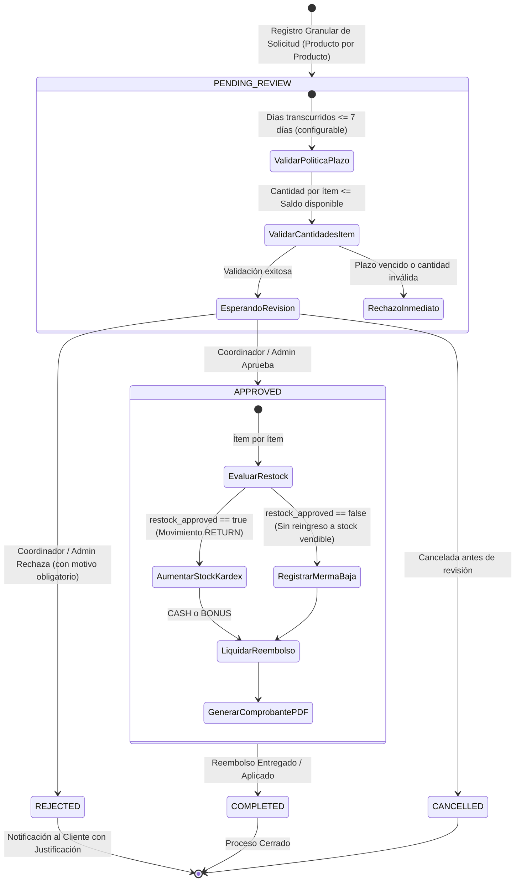

# Plan Detallado de Implementación: Módulo de Devoluciones (POS & Portal Cliente)

> **Documento:** Plan de Arquitectura, Base de Datos e Implementación  
> **Ubicación:** `docs/plan-implementacion-modulo-devoluciones.md`  
> **Fecha de actualización:** Octubre 2026  
> **Estado:** Aprobado con Parámetros de Negocio (7 días, Cash/Bono, Selección Granular de Productos)  

---

## 1. Introducción y Parámetros de Negocio Definidos

El objetivo de este módulo es gestionar el ciclo de vida completo de las devoluciones de mercancía en el sistema POS, cubriendo desde la solicitud vinculada a una venta previa hasta su validación contra políticas de tienda, aprobación/rechazo por personal autorizado, afectación automática del inventario (Kardex), generación del comprobante digital en PDF y la visibilidad para el cliente a través de su portal web.

### Parámetros de Negocio Clave Incorporados:
1. **Plazo de Devolución:** Configurable por empresa y tienda en la tabla de políticas, con un **valor por defecto de 7 días calendario** a partir de la fecha de la venta original (`sale.created_at`).
2. **Métodos de Reembolso Exclusivos:** Únicamente se admiten dos canales de reembolso:
   - **Efectivo (`CASH`):** Salida de dinero por caja POS.
   - **Bono (`BONUS`):** Acreditación directa al saldo de bonos/puntos del cliente en la tienda (`sys.bonuses` / `sys.bonus_transactions`).
3. **Selección Granular Obligatoria de Productos:**
   - La devolución **nunca se aplica sobre toda la compra en masa por defecto**.
   - El operador o cliente debe **seleccionar producto por producto** de forma explícita.
   - Para cada producto seleccionado, se define de manera individual:
     - Cantidad devuelta (validada contra el saldo pendiente disponible: $\text{comprada} - \text{ya devuelta previamente}$).
     - Estado/condición física del producto (`Sellado`, `Abierto`, `Defectuoso`).
     - Decisión de reingreso al inventario físico (`restock_approved`).
     - Motivo individual si aplica.
   - Se puede devolver la totalidad de la venta únicamente si el usuario selecciona cada uno de los ítems y sus cantidades máximas de forma granular.

---

## 2. Diagrama de Flujo y Máquina de Estados



---

## 3. Diseño Limpio de Base de Datos (DDL PostgreSQL)

Para evitar esquemas incompletos, se diseñan 3 tablas dentro del esquema `sys`:
1. `sys.return_policies`: Define las reglas comerciales por empresa y tienda (plazo de 7 días por defecto, métodos permitidos).
2. `sys.sale_returns`: Cabecera de la devolución con trazabilidad completa de estados, aprobaciones, montos e información de reembolso (`CASH` o `BONUS`).
3. `sys.sale_return_items`: Detalle granular de productos devueltos, estado físico del producto, validación de restock e impacto financiero individual.

```sql
-- =============================================================================
-- 1. TABLA: sys.return_policies (Políticas Comerciales de Devolución)
-- =============================================================================
CREATE TABLE IF NOT EXISTS sys.return_policies (
    id SERIAL PRIMARY KEY,
    company_id INT NOT NULL,
    store_id INT NULL, -- NULL indica que aplica a todas las tiendas de la empresa
    name VARCHAR(100) NOT NULL,
    description TEXT NULL,
    max_days_allowed INT NOT NULL DEFAULT 7, -- Plazo configurable: 7 días por defecto
    allow_partial_returns BOOLEAN NOT NULL DEFAULT TRUE,
    requires_original_receipt BOOLEAN NOT NULL DEFAULT TRUE,
    allow_opened_box BOOLEAN NOT NULL DEFAULT FALSE,
    require_approval BOOLEAN NOT NULL DEFAULT TRUE,
    allowed_refund_methods VARCHAR(50) NOT NULL DEFAULT 'CASH,BONUS', -- Exclusivamente CASH y BONUS
    is_active BOOLEAN NOT NULL DEFAULT TRUE,
    created_at TIMESTAMPTZ NOT NULL DEFAULT NOW(),
    updated_at TIMESTAMPTZ NOT NULL DEFAULT NOW(),
    CONSTRAINT return_policies_company_fkey FOREIGN KEY (company_id) REFERENCES sys.companies(id) ON DELETE CASCADE,
    CONSTRAINT return_policies_store_fkey FOREIGN KEY (store_id) REFERENCES sys.stores(id) ON DELETE CASCADE,
    CONSTRAINT chk_max_days_positive CHECK (max_days_allowed >= 1)
);

CREATE INDEX IF NOT EXISTS idx_return_policies_lookup ON sys.return_policies(company_id, store_id, is_active);

-- =============================================================================
-- 2. TABLA: sys.sale_returns (Cabecera de Solicitud y Proceso de Devolución)
-- =============================================================================
CREATE TABLE IF NOT EXISTS sys.sale_returns (
    id SERIAL PRIMARY KEY,
    return_number VARCHAR(50) NOT NULL UNIQUE, -- Formato consecutivo: DEV-000001
    sale_id INT NOT NULL,
    company_id INT NOT NULL,
    store_id INT NOT NULL,
    customer_id INT NULL,
    policy_id INT NULL,
    
    -- Flujo de Estado
    status VARCHAR(30) NOT NULL DEFAULT 'PENDING_REVIEW', 
    -- 'PENDING_REVIEW', 'APPROVED', 'REJECTED', 'COMPLETED', 'CANCELLED'
    
    channel VARCHAR(30) NOT NULL DEFAULT 'IN_STORE', 
    -- 'IN_STORE', 'CUSTOMER_PORTAL'
    
    -- Trazabilidad de Usuarios
    requested_by_user_id UUID NULL, -- Cajero o usuario que radicó
    reviewed_by_user_id UUID NULL,  -- Coordinador o Administrador que aprobó/rechazó
    reviewed_at TIMESTAMPTZ NULL,
    
    -- Justificación y Motivos
    reason_category VARCHAR(50) NOT NULL, 
    -- 'DEFECTIVE_PRODUCT', 'WRONG_ITEM', 'CUSTOMER_REGRET', 'NOT_AS_EXPECTED', 'EXPIRED_PRODUCT', 'OTHER'
    customer_notes TEXT NULL,
    review_notes TEXT NULL,
    rejection_reason TEXT NULL,
    
    -- Liquidación Financiera Acumulada de los Ítems Seleccionados
    subtotal_refund NUMERIC(18, 4) NOT NULL DEFAULT 0,
    tax_refund NUMERIC(18, 4) NOT NULL DEFAULT 0,
    discount_adjustment NUMERIC(18, 4) NOT NULL DEFAULT 0,
    total_refund NUMERIC(18, 4) NOT NULL DEFAULT 0,
    
    -- Método de Reembolso: Estrictamente CASH o BONUS
    refund_method VARCHAR(20) NULL,
    refund_status VARCHAR(30) NOT NULL DEFAULT 'PENDING', 
    -- 'PENDING', 'PROCESSED', 'FAILED'
    refund_reference VARCHAR(100) NULL, -- Ej: ID de transacción de bono o comprobante de caja
    
    -- Auditoría
    created_at TIMESTAMPTZ NOT NULL DEFAULT NOW(),
    updated_at TIMESTAMPTZ NOT NULL DEFAULT NOW(),
    
    CONSTRAINT sale_returns_sale_fkey FOREIGN KEY (sale_id) REFERENCES sys.sales(id) ON DELETE RESTRICT,
    CONSTRAINT sale_returns_company_fkey FOREIGN KEY (company_id) REFERENCES sys.companies(id) ON DELETE CASCADE,
    CONSTRAINT sale_returns_store_fkey FOREIGN KEY (store_id) REFERENCES sys.stores(id) ON DELETE RESTRICT,
    CONSTRAINT sale_returns_customer_fkey FOREIGN KEY (customer_id) REFERENCES sys.customers(id) ON DELETE SET NULL,
    CONSTRAINT sale_returns_policy_fkey FOREIGN KEY (policy_id) REFERENCES sys.return_policies(id) ON DELETE SET NULL,
    CONSTRAINT sale_returns_requested_by_fkey FOREIGN KEY (requested_by_user_id) REFERENCES sys.users(id) ON DELETE SET NULL,
    CONSTRAINT sale_returns_reviewed_by_fkey FOREIGN KEY (reviewed_by_user_id) REFERENCES sys.users(id) ON DELETE SET NULL,
    CONSTRAINT chk_sale_returns_refund_method CHECK (refund_method IS NULL OR refund_method IN ('CASH', 'BONUS'))
);

CREATE INDEX IF NOT EXISTS idx_sale_returns_sale_id ON sys.sale_returns(sale_id);
CREATE INDEX IF NOT EXISTS idx_sale_returns_store_status ON sys.sale_returns(store_id, status);
CREATE INDEX IF NOT EXISTS idx_sale_returns_customer ON sys.sale_returns(customer_id);
CREATE INDEX IF NOT EXISTS idx_sale_returns_created_at ON sys.sale_returns(created_at DESC);

-- =============================================================================
-- 3. TABLA: sys.sale_return_items (Detalle Granular de Productos Devueltos)
-- =============================================================================
CREATE TABLE IF NOT EXISTS sys.sale_return_items (
    id SERIAL PRIMARY KEY,
    sale_return_id INT NOT NULL,
    sale_item_id INT NOT NULL,
    product_id INT NOT NULL,
    product_name VARCHAR(255) NOT NULL, -- Snapshot inmutable del nombre
    
    quantity INT NOT NULL, -- Cantidad devuelta de este producto específico
    unit_price NUMERIC(18, 4) NOT NULL,
    discount_unit NUMERIC(18, 4) NOT NULL DEFAULT 0,
    tax_rate NUMERIC(5, 2) NOT NULL DEFAULT 0,
    tax_amount NUMERIC(18, 4) NOT NULL DEFAULT 0,
    line_subtotal NUMERIC(18, 4) NOT NULL,
    line_total_refund NUMERIC(18, 4) NOT NULL,
    
    -- Evaluación física por producto
    item_condition VARCHAR(50) NOT NULL DEFAULT 'SEALED_NEW',
    -- 'SEALED_NEW', 'OPEN_BOX_GOOD', 'DEFECTIVE_FACTORY', 'DAMAGED_CUSTOMER'
    
    item_reason VARCHAR(255) NULL,
    
    -- Control de reingreso al inventario
    restock_approved BOOLEAN NOT NULL DEFAULT TRUE, -- TRUE: regresa al stock físico; FALSE: merma/dañado
    
    created_at TIMESTAMPTZ NOT NULL DEFAULT NOW(),
    
    CONSTRAINT sale_return_items_return_fkey FOREIGN KEY (sale_return_id) REFERENCES sys.sale_returns(id) ON DELETE CASCADE,
    CONSTRAINT sale_return_items_sale_item_fkey FOREIGN KEY (sale_item_id) REFERENCES sys.sale_items(id) ON DELETE RESTRICT,
    CONSTRAINT sale_return_items_product_fkey FOREIGN KEY (product_id) REFERENCES sys.products(id) ON DELETE RESTRICT,
    CONSTRAINT chk_sale_return_quantity_positive CHECK (quantity > 0)
);

CREATE INDEX IF NOT EXISTS idx_return_items_return_id ON sys.sale_return_items(sale_return_id);
CREATE INDEX IF NOT EXISTS idx_return_items_sale_item ON sys.sale_return_items(sale_item_id);
CREATE INDEX IF NOT EXISTS idx_return_items_product ON sys.sale_return_items(product_id);
```

---

## 4. Arquitectura y Módulos de Backend (NestJS)

Se estructurará un nuevo módulo `ReturnsModule` en `src/modules/returns/`, interactuando con `SalesModule`, `ProductsModule` y `CustomerPortalModule`.

```
proyecto-uni-pos-back/src/modules/returns/
├── dto/
│   ├── create-return-request.dto.ts   # Validación granular producto por producto
│   ├── review-return.dto.ts           # Aprobación/Rechazo con método (CASH o BONUS)
│   ├── get-all-returns.dto.ts         # Filtros de búsqueda y paginación
│   └── return-response.dto.ts
├── entities/
│   ├── sale-return.entity.ts
│   ├── sale-return-item.entity.ts
│   └── return-policy.entity.ts
├── returns.controller.ts
├── returns.service.ts
└── returns.module.ts
```

### 4.1 DTO de Registro Granular (`create-return-request.dto.ts`)
Para garantizar la selección producto por producto con cantidades validadas:

```typescript
import { Type } from 'class-transformer';
import {
    ArrayMinSize,
    IsArray,
    IsBoolean,
    IsIn,
    IsInt,
    IsNotEmpty,
    IsOptional,
    IsPositive,
    IsString,
    ValidateNested,
} from 'class-validator';

export class ReturnItemInputDto {
    @IsInt()
    @IsNotEmpty()
    saleItemId!: number;

    @IsInt()
    @IsNotEmpty()
    productId!: number;

    @IsInt()
    @IsPositive()
    quantity!: number; // Cantidad específica a devolver de este producto

    @IsString()
    @IsIn(['SEALED_NEW', 'OPEN_BOX_GOOD', 'DEFECTIVE_FACTORY', 'DAMAGED_CUSTOMER'])
    itemCondition!: string;

    @IsBoolean()
    restockApproved!: boolean; // Si ingresa a stock vendible o no

    @IsString()
    @IsOptional()
    itemReason?: string;
}

export class CreateReturnRequestDto {
    @IsInt()
    @IsNotEmpty()
    saleId!: number;

    @IsString()
    @IsNotEmpty()
    reasonCategory!: string;

    @IsString()
    @IsIn(['CASH', 'BONUS'])
    preferredRefundMethod!: 'CASH' | 'BONUS'; // Exclusivo CASH o BONUS

    @IsString()
    @IsOptional()
    customerNotes?: string;

    // OBLIGATORIO: Arreglo de productos seleccionados uno por uno (mínimo 1 producto)
    @IsArray()
    @ArrayMinSize(1, { message: 'Debe seleccionar al menos un producto para la devolución.' })
    @ValidateNested({ each: true })
    @Type(() => ReturnItemInputDto)
    items!: ReturnItemInputDto[];
}
```

---

## 5. Endpoints de la API REST

### 5.1 Gestión Administrativa y de Tienda (`/sales/returns`)
Todos protegidos con `JwtAuthGuard` y `PermissionGuard`.

| Método | Endpoint | Permiso Requerido | Descripción |
|---|---|---|---|
| `POST` | `/sales/returns/eligibility` | `sale:read` | Recibe `saleId` y retorna: si está en plazo (7 días por defecto), ítems de la venta con su cantidad original y **saldo máximo pendiente por devolver de cada producto**. |
| `POST` | `/sales/returns/create` | `return:create` | Registra la solicitud granular en estado `PENDING_REVIEW` calculando montos automáticamente. |
| `GET` | `/sales/returns` | `return:read` | Listado paginado y con filtros (tienda, estado, rango de fechas, cliente). |
| `GET` | `/sales/returns/:id` | `return:read` | Detalle exhaustivo con desglose de ítems, condición física y trazabilidad. |
| `POST` | `/sales/returns/:id/approve` | `return:approve` | Aprueba la solicitud, incrementa inventario si aplica, liquida reembolso (`CASH` o `BONUS`) y genera comprobante. |
| `POST` | `/sales/returns/:id/reject` | `return:reject` | Rechaza la solicitud con motivo formal obligatorio; no altera stock ni dinero. |
| `GET` | `/sales/returns/:id/receipt-data` | `return:read` | Retorna los datos normalizados para renderizar o reimprimir el comprobante digital PDF. |

### 5.2 Portal de Clientes (`/customer-portal/returns`)
| Método | Endpoint | Parámetros | Descripción |
|---|---|---|---|
| `GET` | `/customer-portal/returns` | `customerId, companyId, storeId` | Lista histórica de devoluciones del cliente con sus respectivos estados (`PENDING`, `APPROVED`, `REJECTED`). |
| `GET` | `/customer-portal/returns/:id` | `id, customerId` | Detalle específico de la solicitud (motivo de rechazo o confirmación de reembolso). |

---

## 6. Lógica de Negocio y Transaccionalidad Atómica

### 6.1 Validación Estricta de Políticas
1. **Validación de Plazo (7 días por defecto):**
   ```typescript
   const policy = await this.getApplicablePolicy(sale.company_id, sale.store_id);
   const maxDays = policy?.maxDaysAllowed ?? 7;
   const daysDiff = (Date.now() - new Date(sale.created_at).getTime()) / (1000 * 60 * 60 * 24);
   
   if (daysDiff > maxDays) {
       throw new BadRequestException(
           `El plazo máximo permitido para devoluciones es de ${maxDays} días. Esta venta tiene ${Math.floor(daysDiff)} días.`
       );
   }
   ```
2. **Validación de Cantidades Granulares (Anti-Sobrecargo):**
   Para cada producto enviado en `dto.items`:
   - Se consulta `sale_items` para verificar que el producto pertenezca a la venta.
   - Se consulta la sumatoria de cantidades ya devueltas en devoluciones previas no rechazadas (`APPROVED` o `PENDING_REVIEW`):
     $$\text{Saldo Disponible} = \text{sale\_item.quantity} - \sum \text{quantity\_devuelta\_previa}$$
   - Si $\text{item.quantity} > \text{Saldo Disponible}$, se arroja `BadRequestException`:
     `"Cantidad solicitada para ${producto} (${item.quantity}) supera el saldo disponible (${saldoDisponible})."`

### 6.2 Proceso de Aprobación Atómica (`approve`)
Se ejecuta estrictamente dentro de `processTransaction(this.dataSource, async (queryRunner) => { ... })`:
1. **Bloqueo pesimista:** `findOne(SaleReturn, { where: { id }, lock: { mode: 'pessimistic_write' } })`.
2. **Validación de estado:** Debe estar en `PENDING_REVIEW`.
3. **Afectación de Inventario Físico (Kardex):**
   Para cada ítem con `restock_approved === true`:
   - Se obtiene el producto con bloqueo pesimista.
   - `newStock = product.stock + item.quantity`.
   - Se actualiza `Product.stock`.
   - Se inserta en `StockMovement`:
     - `type: 'RETURN'`
     - `quantity: +item.quantity` (positivo, entra al stock vendible)
     - `previousStock: product.stock`
     - `newStock: newStock`
     - `reason: 'Devolución #' + returnRecord.return_number`
4. **Liquidación del Reembolso (`CASH` o `BONUS`):**
   - **Si `BONUS`:**
     - Se localiza o crea el registro en `sys.bonuses` para el cliente en la empresa/tienda.
     - `total_amount = total_amount + total_refund`.
     - Se registra la transacción en `sys.bonus_transactions` con `amount: +total_refund`.
     - Se marca `refund_status: 'PROCESSED'`, `refund_reference: 'Acreditado a Bonos'`.
   - **Si `CASH`:**
     - Se marca `refund_status: 'PROCESSED'`, `refund_reference: 'Reembolso en Caja POS'`.
5. **Cierre y Auditoría:**
   - `status = 'APPROVED'`, `reviewed_by_user_id = reviewerUserId`, `reviewed_at = new Date()`.
   - Registro en bitácora con `auditService.logAction(...)` (`module: 'returns'`, `action: 'APPROVE_RETURN'`).

---

## 7. Generación del Comprobante Digital PDF

### Estructura de la Tirilla/Comprobante (`returnReceiptPdf.ts`):
- **Encabezado:** Empresa, NIT, Tienda, Dirección, Teléfono.
- **Identificador:** Comprobante de Devolución `DEV-000001`, Fecha y Hora, Estado `APROBADA`.
- **Referencia:** Venta asociada `#1234`, Fecha de compra.
- **Cliente:** Nombre, Cédula/NIT.
- **Detalle de Ítems Devueltos (Granular):**
  - Nombre del producto.
  - Condición declarada (`Nuevo/Sellado`, `Abierto`, etc.).
  - Cantidad devuelta.
  - Precio unitario, IVA y Total devuelto por línea.
- **Totales:** Subtotal reembolsado, IVA reembolsado, Total a reintegrar.
- **Método de Reembolso:** `EFECTIVO (CASH)` o `BONO EN TIENDA (BONUS)`.
- **Auditoría:** Nombre del supervisor/administrador que autorizó la devolución.

Implementado en el frontend usando `jspdf` y `jspdf-autotable`.

---

## 8. Diseño de Pantallas en el Frontend

### 8.1 Modal "Solicitud de Devolución" (`CreateReturnModal.tsx`)
- Al presionar *"Devolución"* en una venta del historial:
  1. Se consulta `/sales/returns/eligibility` para traer los ítems y sus saldos disponibles.
  2. Si la venta supera los 7 días, se muestra alerta visual bloqueante informando el vencimiento del plazo.
  3. **Tabla interactiva producto por producto:**
     - Checkbox para activar cada producto individualmente.
     - Input numérico de cantidad por producto (mínimo 1, máximo el saldo disponible de ese producto).
     - Selector de condición: `Sellado / Nuevo`, `Abierto`, `Defectuoso`.
     - Switch `Reingresar al inventario` (activado por defecto si es Sellado/Abierto, desactivado si es Defectuoso).
     - Botón de conveniencia *"Seleccionar todos"* (marca todos los ítems individuales con su cantidad máxima disponible, permitiendo al usuario desmarcar o cambiar cantidades a voluntad).
  4. **Selector de Reembolso:** Radio button exclusivo entre **Efectivo (`CASH`)** y **Bono en Tienda (`BONUS`)**.
  5. Campo de texto para motivo general y observaciones.
  6. Resumen financiero en tiempo real calculando subtotal e impuestos de los productos seleccionados.

### 8.2 Bandeja de Devoluciones (`ReturnsPage.tsx`)
- Pestañas: *Pendientes*, *Aprobadas*, *Rechazadas*.
- Acciones para administradores y coordinadores de tienda:
  - Botón **Aprobar** (abre confirmación mostrando el método de reembolso elegido).
  - Botón **Rechazar** (solicita justificación obligatoria).
  - Botón **Descargar Comprobante PDF**.

### 8.3 Portal de Clientes (`CustomerPortalPage.tsx`)
- Pestaña *"Mis Devoluciones"*.
- Lista de solicitudes con fecha, monto, método de reembolso (`CASH` o `BONUS`) y estado:
  - 🟡 *En Revisión por Tienda*
  - 🟢 *Aprobada* (con botón para descargar PDF)
  - 🔴 *Rechazada* (con tarjeta explicativa del motivo del rechazo)

---

## 9. Plan de Ejecución Fase por Fase

### Fase 1: Base de Datos y Permisos
1. Ejecutar DDL en PostgreSQL creando `sys.return_policies`, `sys.sale_returns` y `sys.sale_return_items`.
2. Insertar política por defecto (`max_days_allowed = 7`, `allowed_refund_methods = 'CASH,BONUS'`).
3. Registrar permisos en `sys.permissions`: `return:create`, `return:read`, `return:approve`, `return:reject`.
4. Asignar permisos a roles en `sys.role_permissions` (Cajero: `create`, `read`; Coordinador/Admin: todos).

### Fase 2: Backend (NestJS)
1. Crear entidades TypeORM (`sale-return.entity.ts`, `sale-return-item.entity.ts`, `return-policy.entity.ts`).
2. Actualizar unión de tipos en `StockMovement.type` para soportar `'RETURN'`.
3. Desarrollar DTOs con `class-validator` (validación granular de `items`).
4. Implementar `ReturnsService` (validación de 7 días, control de saldo disponible, aprobación atómica con Kardex y liquidación CASH/BONUS).
5. Implementar `ReturnsController` con guards de permisos.
6. Integrar endpoints en `CustomerPortalController` y `CustomerPortalService`.

### Fase 3: Frontend (React / Tailwind)
1. Crear `returnService.ts` con tipados en `src/types/Returns.ts`.
2. Crear generador de comprobante `src/utils/returnReceiptPdf.ts`.
3. Crear modal granular `CreateReturnModal.tsx` en el módulo de ventas.
4. Crear vista de administración `ReturnsPage.tsx` con flujos de aprobación y rechazo.
5. Agregar pestaña "Mis Devoluciones" en `CustomerPortalPage.tsx`.

### Fase 4: Pruebas y Verificación
1. Validar rechazo automático de ventas con más de 7 días.
2. Validar que no permita devolver más unidades de las compradas de un ítem.
3. Validar afectación de inventario en `Product.stock` y registro en `StockMovement`.
4. Validar acreditación a `sys.bonuses` cuando el reembolso es `BONUS`.
5. Validar entrega de efectivo cuando el reembolso es `CASH`.
6. Probar generación y descarga del PDF del comprobante.
