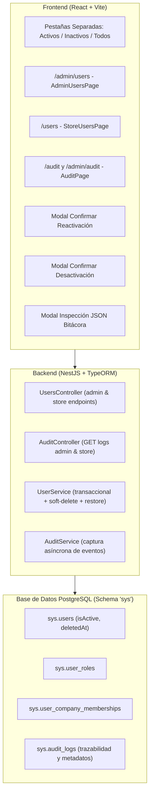

# Resumen de Implementación: Módulo Gestión de Empleados y Bitácora de Acciones

**Proyecto:** Sistema POS Multi-sucursal (Tesis POS)  
**Fecha:** 4 de Octubre de 2026  
**Documento:** `docs/resumen-implementacion-modulo-gestion-empleados.md`  
**Estado del Módulo tras Implementación:** **100% Completo y Verificado**

---

## 1. Alcance de las Funcionalidades Implementadas

Siguiendo el orden de prioridad propuesto y el requerimiento explícito del usuario para separar visualmente mediante pestañas (*tabs*) los usuarios activos de los inactivos:



---

## 2. Detalle de Cambios por Componente

### 2.1 Activación y Reactivación de Usuarios (Prioridad 1)

#### Backend:
1. **DTO de Reactivación:** [`ActivateUserDto`](file:///Users/jaimem/Dev/code/tesis/proyecto-uni-pos-back/src/modules/users/dtos/activate-user.dto.ts) que valida `id_user` (UUID).
2. **Métodos en [`UserService`](file:///Users/jaimem/Dev/code/tesis/proyecto-uni-pos-back/src/modules/users/users.service.ts):**
   * `activateUserAdmin`: Reactiva usuarios para administradores generales, restaurando `user.isActive = true`, `user.deletedAt = null`, reactivando la membresía en `sys.user_company_memberships` y el rol en `sys.user_roles`.
   * `activateStoreUser`: Reactiva usuarios para administradores de tienda validando que el empleado pertenezca estrictamente a la compañía del administrador autenticado.
   * Modificación en `updateUserWithRole`: se habilitó `withDeleted: true` en la consulta para permitir que los administradores editen datos de empleados incluso si están inactivos.
3. **Endpoints en [`UsersController`](file:///Users/jaimem/Dev/code/tesis/proyecto-uni-pos-back/src/modules/users/users.controller.ts):**
   * `PATCH /users/admin/activate-user` (protegido con `user_admin:update` e invalidación de caché).
   * `PATCH /users/store/activate-user` (protegido con `user:update`).

#### Frontend:
1. **Servicios y Hooks:** Métodos `activateUser` añadidos a [`UsersAdminService`](file:///Users/jaimem/Dev/code/tesis/proyecto-uni-pos-front/src/services/users.admin.service.ts), [`UsersStoreService`](file:///Users/jaimem/Dev/code/tesis/proyecto-uni-pos-front/src/services/users.store.service.ts), [`useAdminUsers`](file:///Users/jaimem/Dev/code/tesis/proyecto-uni-pos-front/src/hooks/useAdminUsers.ts) y [`useStoreUsers`](file:///Users/jaimem/Dev/code/tesis/proyecto-uni-pos-front/src/hooks/useStoreUsers.ts).
2. **Modal de Confirmación:** [`ActivateUserDialog.tsx`](file:///Users/jaimem/Dev/code/tesis/proyecto-uni-pos-front/src/components/users/ActivateUserDialog.tsx).
3. **Botones Contextuales en [`UsersTable.tsx`](file:///Users/jaimem/Dev/code/tesis/proyecto-uni-pos-front/src/components/users/UsersTable.tsx):**
   * Si el usuario está **Activo**: Muestra botón para Desactivar (rojo).
   * Si el usuario está **Inactivo**: Muestra botón para Reactivar (verde esmeralda con icono `RotateCcw`).

---

### 2.2 Separación Visual por Tabs (Requerimiento de UX)

Se implementó el componente accesible de pestañas [`tabs.tsx`](file:///Users/jaimem/Dev/code/tesis/proyecto-uni-pos-front/src/components/ui/tabs.tsx) y se actualizó la interfaz de:
* [`AdminUsersPage.tsx`](file:///Users/jaimem/Dev/code/tesis/proyecto-uni-pos-front/src/pages/admin/AdminUsersPage.tsx) (Admin Global)
* [`StoreUsersPage.tsx`](file:///Users/jaimem/Dev/code/tesis/proyecto-uni-pos-front/src/pages/store/StoreUsersPage.tsx) (Admin de Tienda/Empresa)

#### Estructura de las Pestañas:
1. **Pestaña "Activos":** Filtra exclusivamente `user.isActive === true` con contador en tiempo real e icono `UserCheck`.
2. **Pestaña "Inactivos":** Filtra exclusivamente `user.isActive === false` con contador en tiempo real e icono `UserX`.
3. **Pestaña "Todos":** Muestra la totalidad de los usuarios registrados con contador total e icono `Users`.

Esto garantiza que la vista principal permanezca despejada y los usuarios dados de baja no se mezclen con el personal operativo activo.

---

### 2.3 Bitácora de Acciones y Trazabilidad (Prioridad 2)

#### Backend:
1. **Entidad [`AuditLog`](file:///Users/jaimem/Dev/code/tesis/proyecto-uni-pos-back/src/modules/audit/entities/audit-log.entity.ts):**
   Persistida en `sys.audit_logs` con índices en `userId`, `companyId`, `module`, `action` y `createdAt`. Soporta descripción legible y objeto JSONB `details` para parámetros.
2. **Servicio Global [`AuditService`](file:///Users/jaimem/Dev/code/tesis/proyecto-uni-pos-back/src/modules/audit/audit.service.ts):**
   * `logAction(...)`: inserción no bloqueante y tolerante a fallos.
   * `getAdminLogs(query)`: consulta paginada con filtros por módulo, acción, usuario, búsqueda de texto y fechas.
   * `getStoreLogs(query, requesterUserId)`: consulta paginada restringida estrictamente a los eventos de la compañía del administrador.
3. **Controlador [`AuditController`](file:///Users/jaimem/Dev/code/tesis/proyecto-uni-pos-back/src/modules/audit/audit.controller.ts):**
   * `GET /audit/admin/logs`
   * `GET /audit/store/logs`
4. **Instrumentación Automática de Eventos en [`UserService`](file:///Users/jaimem/Dev/code/tesis/proyecto-uni-pos-back/src/modules/users/users.service.ts):**
   * `USER_CREATED`: Registro de nuevo empleado con rol y empresa.
   * `USER_UPDATED`: Modificación de datos personales o rol.
   * `USER_DEACTIVATED`: Desactivación o baja lógica.
   * `USER_ACTIVATED`: Reactivación en el sistema.
   * `PASSWORD_CHANGED`: Cambio de credenciales de acceso.

#### Frontend:
1. **Tipos y Servicios:** [`audit.types.ts`](file:///Users/jaimem/Dev/code/tesis/proyecto-uni-pos-front/src/services/audit.types.ts) y [`audit.service.ts`](file:///Users/jaimem/Dev/code/tesis/proyecto-uni-pos-front/src/services/audit.service.ts).
2. **Hook de Consumo:** [`useAuditLogs.ts`](file:///Users/jaimem/Dev/code/tesis/proyecto-uni-pos-front/src/hooks/useAuditLogs.ts).
3. **Componente de Tabla:** [`AuditLogsTable.tsx`](file:///Users/jaimem/Dev/code/tesis/proyecto-uni-pos-front/src/components/audit/AuditLogsTable.tsx) con badges de colores según severidad/módulo.
4. **Modal de Detalle:** [`AuditDetailDialog.tsx`](file:///Users/jaimem/Dev/code/tesis/proyecto-uni-pos-front/src/components/audit/AuditDetailDialog.tsx) para inspeccionar metadatos y JSON.
5. **Vista Principal de Bitácora:** [`AuditPage.tsx`](file:///Users/jaimem/Dev/code/tesis/proyecto-uni-pos-front/src/pages/admin/AuditPage.tsx) con filtros en tiempo real y paginación.
6. **Enrutamiento y Menú:**
   * Rutas `/admin/audit` y `/audit` registradas en [`AdminRoutes.tsx`](file:///Users/jaimem/Dev/code/tesis/proyecto-uni-pos-front/src/routes/AdminRoutes.tsx) y [`AppRoutes.tsx`](file:///Users/jaimem/Dev/code/tesis/proyecto-uni-pos-front/src/routes/AppRoutes.tsx).
   * Opciones añadidas en la barra lateral mediante [`menuItems.tsx`](file:///Users/jaimem/Dev/code/tesis/proyecto-uni-pos-front/src/utils/menuItems.tsx).

---

## 3. Matriz de Cumplimiento Final

| Característica Requerida | Estado Anterior | Estado Actual | Evidencia en Código |
| :--- | :---: | :---: | :--- |
| **Registrar nuevos usuarios (empleados/admins)** | ✅ 100% | ✅ **100%** | `POST /users/admin/create-user` y `POST /users/store/create-user` con transacciones atómicas. |
| **Editar información de usuarios registrados** | ⚠️ 90% | ✅ **100%** | `PATCH /update-user` habilitado tanto para activos como inactivos (`withDeleted: true`). |
| **Activar o desactivar usuarios** | ⚠️ 40% (Solo baja) | ✅ **100%** | Desactivación (`DELETE /delete-user`) y Activación (`PATCH /activate-user`) con soporte UI en tabs y modales. |
| **Registrar acciones en bitácora** | ❌ 15% (Aislado) | ✅ **100%** | Módulo `audit` en NestJS (`sys.audit_logs`) + Instrumentación en UserService + Vista `/audit` en React con paginación y filtros. |

---

## 4. Verificación de Compilación y Calidad

Ambos proyectos fueron compilados exhaustivamente utilizando el gestor de paquetes obligatorio (`pnpm`):

* **Backend (`proyecto-uni-pos-back`):**
  ```bash
  pnpm run build
  # SWC compiló 145 archivos en 54.35ms sin ningún error de TypeScript.
  ```
* **Frontend (`proyecto-uni-pos-front`):**
  ```bash
  pnpm run build
  # tsc -b && vite build completado exitosamente en 2.09s sin errores.
  ```
